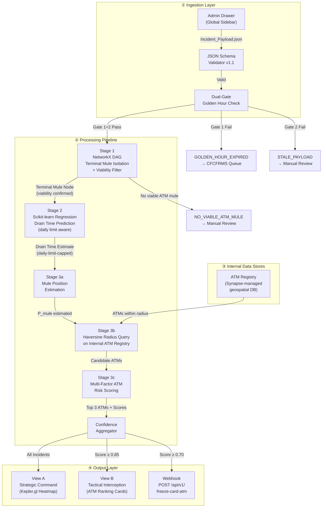

# Project Synapse — Product Requirements Document

> **Document Classification:** RESTRICTED — For Official Use Only  
> **Version:** 2.0.0  
> **Date:** 06 September 2026  
> **Author:** Principal Technical Product Manager, Synapse Programme  
> **Sponsor:** Indian Cyber Crime Coordination Centre (I4C), Ministry of Home Affairs, Government of India  
> **Status:** DRAFT — Pending Stakeholder Review

---

## Table of Contents

1. [Executive Summary & Golden Hour Scope](#1-executive-summary--golden-hour-scope)
2. [User Personas & RBAC](#2-user-personas--rbac)
3. [Data Schemas](#3-data-schemas)
   - 3.1 [Ingestion Payload Schema](#31-ingestion-payload-schema--incident_payloadjson)
   - 3.2 [Bank Webhook Payload Schema](#32-bank-webhook-payload-schema--freeze-card-atm)
   - 3.3 [Complete JSON Examples](#33-complete-json-examples-with-realistic-mock-values)
4. [End-to-End Pipeline Architecture & Math/Logic Breakdown](#4-end-to-end-pipeline-architecture--mathlogic-breakdown)
5. [Functional Requirements](#5-functional-requirements)
6. [Synthetic Data Generation Strategy](#6-synthetic-data-generation-strategy)
7. [Bias, False-Positive & Predictive Policing Mitigations](#7-bias-false-positive--predictive-policing-mitigations)
8. [MVP Hackathon Scope & 90-Second Live Demo Script](#8-mvp-hackathon-scope--90-second-live-demo-script)

---

## Changelog from v1.0.0-RC1

> [!IMPORTANT]
> **v1.3.0** incorporates five corrections from a mathematical & logical consistency audit, on top of the eleven prior corrections (v1.1.0 + v1.2.0). All changes are marked inline with `[v1.3 FIX]` tags for traceability.

### v1.3.0 Fixes

| ID | Severity | Fix Summary |
|---|---|---|
| 4A | Critical | Mock `complaint_timestamp` in §3.3.1 fixed: was 01:05:33 (39s *before* the first fraud transaction at 01:06:12 — temporal paradox). Now set to 01:19:15 (1 min after hop 4). All downstream timestamps and demo script narration updated. |
| 4B | Moderate | Drain time baseline formula now subtracts elapsed time τ: `D̂ = max(0, N_w × Δt − τ)`. The old formula computed total session duration (22.5 min) rather than time *remaining* from NOW (18.6 min). Worked example, webhook example, explainability report, and demo script updated. |
| 4C | Critical | Urgency inversion fixed: when `DAILY_LIMIT_EXHAUSTED` (D̂=0), the urgency term evaluated to 1.0 (max urgency) — logically backwards since the mule *cannot* withdraw. Urgency now explicitly clamped to 0.0 when daily limit is exhausted. |
| 4D | High | CNRB-ATM-PNE-0042 `is_onsite` changed from `true` to `false`. An onsite ATM's theoretical max RiskScore is 0.85 (β₄ × 0 = 0), making the mocked score of 0.91 mathematically impossible. Offsite ATM ceiling is 1.0, so 0.91 is now valid. |
| 4E | Moderate | Proximity normalization `D_norm` now uses `r_active` (the actual search radius, which may be expanded) instead of base `r_search`. Prevents negative scores when ATMs are found by an expanded radius (e.g., 6.2 km ATM found at r=7.5 km scored as `1 − 6.2/5.0 = −0.24` under old formula). Added `max(0, ...)` clamp as defense-in-depth. |

### v1.2.0 Fixes

| ID | Severity | Fix Summary |
|---|---|---|
| 1D | Critical | MPS recency term replaced: unbounded reciprocal $1/\Delta t$ (which spiked to 60.0 and dominated all other features) replaced with bounded exponential decay $e^{-\mu \Delta t}$ mapping to $[0, 1]$ |
| 2-clarify | Medium | ADM-09 / ML-03 acceptance criteria clarified: 50K ATM / ≤ 100ms target is a **production** requirement achievable via vectorized NumPy or PostGIS — not applicable to MVP's 200-ATM in-memory scan |
| 3D | High | Golden Hour Gate 1 now uses `max(txn_timestamp)` across ALL transactions instead of fragile `transactions[-1]` array index, which is not guaranteed to be temporally latest in branched/fan-out flows |

### v1.1.0 Fixes

| ID | Severity | Fix Summary |
|---|---|---|
| 1A | Critical | ~~Epsilon guard added to MPS formula to prevent divide-by-zero~~ → **Superseded by 1D** (exponential decay eliminates the divide entirely) |
| 1B | Critical | Drain time baseline now respects daily ATM withdrawal limit (₹1,00,000) |
| 1C | High | ST-DBSCAN replaced with haversine radius query + weighted scoring (ATMs are static, not moving) |
| 2A | High | `candidate_atms` removed from ingestion payload; Synapse maintains internal ATM registry, queried after mule position estimation |
| 2B | High | Golden Hour gate upgraded to dual-gate check: payload freshness AND fraud recency |
| 3A | Medium | `cell_tower_cluster` marked optional (`minItems: 0`); documented as Future State integration |
| 3B | Medium | Mule viability filter added — leaf nodes must have ATM-capable debit cards to qualify |
| 3C | Low | `daily_avg_txn_count` integrated into ATM RiskScore as traffic anonymity factor |

---

## 1. Executive Summary & Golden Hour Scope

### 1.1 Problem Statement

Cyber financial fraud in India has evolved into a high-velocity, multi-layered operation. Funds obtained through vishing, phishing, UPI abuse, and SIM-swap attacks are systematically routed through chains of **mule accounts** — often 4–7 hops deep — and ultimately withdrawn as cash from physical ATMs. Current enforcement operates on a **reactive logging model**: a victim files a complaint on the **1930 helpline** or **NCRP portal**, a ticket enters CFCFRMS (Citizen Financial Cyber Fraud Reporting and Management System), and bank lien requests are issued manually. By the time the lien propagates to the issuing bank's card management switch, funds have typically been cashed out within **45–90 minutes** of the initial fraud.

The gap is not informational — CFCFRMS already captures multi-hop fund flows. The gap is **temporal and spatial**: no system currently predicts *where* and *when* a terminal mule will attempt ATM withdrawal, and no automated mechanism triggers card-level or ATM-level holds at the banking switch fast enough to intercept.

### 1.2 Synapse Mission

**Synapse** is a proactive spatial-temporal interception framework that transforms the I4C response model from *"log → investigate → freeze"* to *"detect → predict → intercept."* It operates exclusively within the **Golden Hour** — the first 120 minutes after a fraud event occurs — to:

1. **Isolate** the terminal mule account in a multi-hop fund flow graph.
2. **Predict** the remaining time until cash-out (drain time regression).
3. **Locate** the Top 3 most probable ATMs for withdrawal using spatial scoring against Synapse's internal ATM registry.
4. **Act** by issuing automated card/ATM hold webhooks (digital tier) or recommending tactical LEA dispatch (physical tier), depending on confidence thresholds.

### 1.3 Golden Hour Definition & Boundary

`[v1.1 FIX 2B]` `[v1.2 FIX 3D]` — The Golden Hour clock is anchored to **fraud recency** (the most recent transaction timestamp across the entire fund flow), not merely complaint filing time. A dual-gate check prevents stale incidents from triggering emergency interventions. v1.2 replaces the fragile `transactions[-1]` array index with an explicit `max(txn_timestamp)` scan, because JSON array order is not guaranteed to reflect temporal order in branched/fan-out fund flows.

| Parameter | Value |
|---|---|
| **Fraud Recency Clock** | `max(t.txn_timestamp for t in fund_flow.transactions)` — the latest transaction timestamp across ALL hops in the fund flow, regardless of array serialization order. `[v1.2 FIX 3D]` |
| **Payload Freshness Clock** | `complaint_timestamp` (1930/NCRP registration) OR `bank_alert_timestamp`, whichever is earlier |
| **Golden Hour Window** | 120 minutes from Fraud Recency Clock |
| **Dual-Gate Admission Criteria** | **Gate 1 (Fraud Recency):** `NOW() − max(txn_timestamp) ≤ 120 min` — the fraud itself is recent enough for interception to be meaningful. **Gate 2 (Payload Freshness):** `NOW() − complaint_timestamp ≤ 240 min` — the complaint was filed within a reasonable window (allows for victim delay in reporting). |
| **Rejection Behavior** | If Gate 1 fails → `GOLDEN_HOUR_EXPIRED` — funds are likely already cashed out. If Gate 1 passes but Gate 2 fails → `STALE_PAYLOAD` — complaint is suspiciously old relative to filing time; route to manual review. |
| **Post-Window Behavior** | Rejected incidents are routed to standard CFCFRMS investigation queue. No Synapse predictions or interventions are generated. |

> [!IMPORTANT]
> Synapse is **not** a general-purpose fraud analytics platform. It is a time-boxed, intervention-focused system. The operative boundary is **fraud recency**, not complaint filing time. A victim defrauded on Monday who files on Thursday will correctly fail Gate 1, even though their complaint is "fresh." Note: `max(txn_timestamp)` is computed by iterating all transactions — it does not rely on array ordering or `hop_index` sorting.

### 1.4 Key Outcomes

| Metric | Current Baseline | Synapse Target (MVP) |
|---|---|---|
| Median time from complaint to bank lien | ~180 min | ≤ 25 min (automated webhook) |
| Fund recovery rate (within Golden Hour) | < 8% | ≥ 35% |
| ATM interception rate (terminal mule) | Near 0% | ≥ 20% (Top-3 hit rate) |
| False-positive card hold rate | N/A | ≤ 15% |

---

## 2. User Personas & RBAC

### 2.1 Persona Definitions

#### Persona 1: Strategic Commander (I4C HQ)

| Attribute | Detail |
|---|---|
| **Role Name** | I4C Strategic Analyst / Joint Secretary Level |
| **Location** | I4C National HQ, New Delhi |
| **Primary Goal** | Macro situational awareness: nationwide fraud patterns, inter-state fund flows, resource allocation decisions |
| **Key Actions** | View national GIS heatmap, analyze inter-state flow arcs, review aggregate KPIs, configure system parameters |
| **Pain Points** | Currently relies on weekly PDF reports from states; no real-time spatial view of active Golden Hour incidents |

#### Persona 2: Tactical Operator (State/District Cyber Cell)

| Attribute | Detail |
|---|---|
| **Role Name** | Cyber Cell Sub-Inspector / Inspector |
| **Location** | State Cyber Police Station or District Cyber Cell |
| **Primary Goal** | Receive actionable interception targets, dispatch field units to ranked ATM locations, acknowledge actions |
| **Key Actions** | Monitor incident queue, review ATM ranking cards, trigger "Acknowledge & Dispatch," log field outcomes |
| **Pain Points** | Receives verbal/WhatsApp alerts with vague location info; no structured ranking of ATM probability; no feedback loop |

#### Persona 3: System Administrator

| Attribute | Detail |
|---|---|
| **Role Name** | I4C Technical Operations Officer |
| **Location** | I4C National HQ, New Delhi |
| **Primary Goal** | System configuration, data ingestion, webhook management, user provisioning, ATM registry maintenance |
| **Key Actions** | Upload `Incident_Payload.json` via Admin Drawer, manage webhook endpoints, configure confidence thresholds, provision user accounts, manage internal ATM registry |
| **Pain Points** | Manual data entry across multiple systems; no unified ingestion interface |

### 2.2 Role-Based Access Control (RBAC) Matrix

| Capability | `ADMIN` | `STRATEGIC_COMMAND` | `TACTICAL_OPERATOR` | `AUDITOR` |
|---|:---:|:---:|:---:|:---:|
| Upload Incident Payload (Admin Drawer) | ✅ | ❌ | ❌ | ❌ |
| Configure ML Thresholds | ✅ | ❌ | ❌ | ❌ |
| Manage Webhook Endpoints | ✅ | ❌ | ❌ | ❌ |
| Manage ATM Registry | ✅ | ❌ | ❌ | ❌ |
| Provision / Deactivate Users | ✅ | ❌ | ❌ | ❌ |
| View A: Strategic Command Dashboard | ✅ | ✅ | ❌ | ✅ (read-only) |
| View B: Tactical Interception Queue | ✅ | ❌ | ✅ | ✅ (read-only) |
| Acknowledge & Dispatch | ❌ | ❌ | ✅ | ❌ |
| View Audit Logs | ✅ | ❌ | ❌ | ✅ |
| Export Reports | ✅ | ✅ | ❌ | ✅ |

> [!NOTE]
> `TACTICAL_OPERATOR` accounts are scoped to their assigned state/district jurisdiction. An operator assigned to `MH` (Maharashtra) can only view incidents where at least one candidate ATM falls within Maharashtra's PIN code range. `STRATEGIC_COMMAND` has a national (all-state) view.

### 2.3 Authentication & Session Policy

| Parameter | Policy |
|---|---|
| Authentication | Username + Password with mandatory TOTP (Time-based OTP) second factor |
| Session Timeout | 30 minutes of inactivity (hard), 8 hours absolute |
| Password Policy | Min 12 chars, 1 uppercase, 1 number, 1 special char, no reuse of last 6 passwords |
| Account Lockout | 5 failed attempts → 15 min lockout → admin unlock required |
| Audit | All login/logout events, all state-changing actions logged with `user_id`, `timestamp`, `ip_address`, `action` |

---

## 3. Data Schemas

### 3.1 Ingestion Payload Schema — `Incident_Payload.json`

This is the single consolidated JSON document uploaded via the Admin Drawer. It merges three logical sub-documents into one payload: the NCRP ticket, the CFCFRMS fund flow, and terminal mule intelligence.

`[v1.1 FIX 2A]` — `candidate_atms` has been **removed** from the ingestion payload. Synapse maintains its own internal geospatial ATM registry (see §5.1, ADM-09) and queries it dynamically after computing the mule's estimated position in Stage 3a. This eliminates the circular dependency where the upstream system would need to know the mule's location before Synapse calculates it.

`[v1.1 FIX 3A]` — `cell_tower_cluster` is now **optional** (`minItems: 0`). Real-time cell tower data requires CDR/LIS authorization in India, which is incompatible with Golden Hour latency requirements. For MVP and near-term production, the pipeline falls back to IP geolocation or IFSC branch coordinates. Cell tower integration is documented as a Future State dependency on telecom API partnerships.

```json
{
  "$schema": "https://json-schema.org/draft/2020-12/schema",
  "$id": "https://synapse.i4c.gov.in/schemas/incident-payload/v1.1",
  "title": "Synapse Incident Payload",
  "description": "Consolidated ingestion payload containing NCRP ticket, CFCFRMS fund flow, and terminal mule intelligence. ATM candidates are NOT included — Synapse queries its internal ATM registry after mule position estimation.",
  "type": "object",
  "required": [
    "payload_version",
    "payload_id",
    "ingestion_timestamp",
    "ncrp_ticket",
    "fund_flow",
    "terminal_mule"
  ],
  "properties": {
    "payload_version": {
      "type": "string",
      "const": "1.1.0",
      "description": "Schema version for forward compatibility."
    },
    "payload_id": {
      "type": "string",
      "format": "uuid",
      "description": "Globally unique identifier for this payload instance."
    },
    "ingestion_timestamp": {
      "type": "string",
      "format": "date-time",
      "description": "ISO 8601 timestamp of when the payload was submitted to Synapse."
    },
    "ncrp_ticket": {
      "type": "object",
      "description": "NCRP / 1930 complaint registration details.",
      "required": [
        "ticket_id",
        "complaint_timestamp",
        "victim_state",
        "victim_district",
        "fraud_type",
        "amount_inr",
        "source_account"
      ],
      "properties": {
        "ticket_id": {
          "type": "string",
          "pattern": "^NCRP-[0-9]{4}-[0-9]{7,10}$",
          "description": "NCRP ticket identifier, e.g. NCRP-2026-0045781."
        },
        "complaint_timestamp": {
          "type": "string",
          "format": "date-time",
          "description": "ISO 8601 timestamp of complaint registration. Used for Gate 2 (Payload Freshness) check."
        },
        "victim_state": {
          "type": "string",
          "minLength": 2,
          "maxLength": 2,
          "description": "Two-letter Indian state code (ISO 3166-2:IN alpha), e.g. MH, DL, KA."
        },
        "victim_district": {
          "type": "string",
          "description": "District name as per Census of India, e.g. Pune, South Delhi."
        },
        "fraud_type": {
          "type": "string",
          "enum": [
            "UPI_FRAUD",
            "VISHING",
            "PHISHING",
            "SIM_SWAP",
            "INVESTMENT_SCAM",
            "LOAN_APP_FRAUD",
            "SEXTORTION",
            "CRYPTO_FRAUD",
            "OTHER"
          ],
          "description": "Categorized fraud type per NCRP taxonomy."
        },
        "amount_inr": {
          "type": "number",
          "minimum": 0,
          "description": "Total defrauded amount in Indian Rupees."
        },
        "source_account": {
          "type": "object",
          "required": ["account_number", "ifsc", "bank_name"],
          "properties": {
            "account_number": {
              "type": "string",
              "pattern": "^[0-9]{9,18}$",
              "description": "Victim's bank account number."
            },
            "ifsc": {
              "type": "string",
              "pattern": "^[A-Z]{4}0[A-Z0-9]{6}$",
              "description": "IFSC code of the victim's bank branch."
            },
            "bank_name": {
              "type": "string",
              "description": "Full name of the victim's bank."
            }
          }
        }
      }
    },
    "fund_flow": {
      "type": "object",
      "description": "CFCFRMS multi-hop transaction trail from victim to terminal mule.",
      "required": ["total_hops", "transactions"],
      "properties": {
        "total_hops": {
          "type": "integer",
          "minimum": 1,
          "maximum": 20,
          "description": "Total number of hops in the observed fund flow chain."
        },
        "transactions": {
          "type": "array",
          "minItems": 1,
          "items": {
            "type": "object",
            "required": [
              "hop_index",
              "txn_id",
              "txn_timestamp",
              "sender_account",
              "sender_ifsc",
              "sender_bank",
              "receiver_account",
              "receiver_ifsc",
              "receiver_bank",
              "amount_inr",
              "channel"
            ],
            "properties": {
              "hop_index": {
                "type": "integer",
                "minimum": 1,
                "description": "Sequential hop number (1 = first hop from victim)."
              },
              "txn_id": {
                "type": "string",
                "description": "Unique transaction reference (UTR/RRN)."
              },
              "txn_timestamp": {
                "type": "string",
                "format": "date-time",
                "description": "ISO 8601 timestamp of the transaction. The last transaction's timestamp is used for Gate 1 (Fraud Recency) Golden Hour check."
              },
              "sender_account": {
                "type": "string",
                "pattern": "^[0-9]{9,18}$"
              },
              "sender_ifsc": {
                "type": "string",
                "pattern": "^[A-Z]{4}0[A-Z0-9]{6}$"
              },
              "sender_bank": {
                "type": "string"
              },
              "receiver_account": {
                "type": "string",
                "pattern": "^[0-9]{9,18}$"
              },
              "receiver_ifsc": {
                "type": "string",
                "pattern": "^[A-Z]{4}0[A-Z0-9]{6}$"
              },
              "receiver_bank": {
                "type": "string"
              },
              "amount_inr": {
                "type": "number",
                "minimum": 0,
                "description": "Transaction amount in INR."
              },
              "channel": {
                "type": "string",
                "enum": ["NEFT", "RTGS", "IMPS", "UPI", "INTERNAL_TRANSFER"],
                "description": "Payment channel used for this hop."
              }
            }
          }
        }
      }
    },
    "terminal_mule": {
      "type": "object",
      "description": "Intelligence on the identified terminal mule (last-mile cash-out suspect).",
      "required": [
        "mule_account_number",
        "mule_ifsc",
        "mule_bank",
        "current_balance_inr",
        "account_type"
      ],
      "properties": {
        "mule_account_number": {
          "type": "string",
          "pattern": "^[0-9]{9,18}$",
          "description": "Terminal mule's bank account number."
        },
        "mule_ifsc": {
          "type": "string",
          "pattern": "^[A-Z]{4}0[A-Z0-9]{6}$",
          "description": "IFSC code of the mule's bank branch."
        },
        "mule_bank": {
          "type": "string",
          "description": "Name of the mule's bank."
        },
        "current_balance_inr": {
          "type": "number",
          "minimum": 0,
          "description": "Current balance in the mule account at time of payload generation."
        },
        "account_type": {
          "type": "string",
          "enum": ["SAVINGS", "CURRENT", "BASIC_SAVINGS_BD", "OVERDRAFT", "UNKNOWN"],
          "description": "[v1.1 FIX 3B] Account type. Used by the mule viability filter to confirm ATM withdrawal eligibility."
        },
        "linked_card_number_hash": {
          "type": ["string", "null"],
          "pattern": "^[a-f0-9]{64}$",
          "description": "[v1.1 FIX 3B] SHA-256 hash of the debit card PAN linked to the mule account. Raw PAN is never transmitted. Null if no physical debit card is linked — in which case the mule viability filter will flag NO_VIABLE_ATM_MULE.",
          "default": null
        },
        "daily_withdrawal_limit_inr": {
          "type": "number",
          "minimum": 0,
          "default": 100000,
          "description": "[v1.1 FIX 1B] Bank-specific daily ATM withdrawal limit in INR. Defaults to ₹1,00,000 if not provided. Used by drain time regression."
        },
        "withdrawals_today_inr": {
          "type": "number",
          "minimum": 0,
          "default": 0,
          "description": "[v1.1 FIX 1B] Amount already withdrawn from ATMs today (since midnight IST). Used to compute remaining daily capacity."
        },
        "cell_tower_cluster": {
          "type": "array",
          "minItems": 0,
          "maxItems": 10,
          "default": [],
          "items": {
            "type": "object",
            "required": ["tower_id", "lat", "lon", "last_seen", "signal_strength_dbm"],
            "properties": {
              "tower_id": {
                "type": "string",
                "description": "Cell tower identifier (CID-LAC composite)."
              },
              "lat": {
                "type": "number",
                "minimum": 6.0,
                "maximum": 37.0,
                "description": "Latitude of the cell tower (WGS 84). Constrained to India's geographic bounds."
              },
              "lon": {
                "type": "number",
                "minimum": 68.0,
                "maximum": 98.0,
                "description": "Longitude of the cell tower (WGS 84). Constrained to India's geographic bounds."
              },
              "last_seen": {
                "type": "string",
                "format": "date-time",
                "description": "Last time the mule's device was observed on this tower."
              },
              "signal_strength_dbm": {
                "type": "integer",
                "minimum": -120,
                "maximum": -30,
                "description": "Signal strength in dBm. Used for trilateration weighting."
              }
            }
          },
          "description": "[v1.1 FIX 3A] OPTIONAL. Recent cell tower observations for the mule's registered mobile device. Requires CDR/LIS authorization from telecom operator — not available in real-time under current Indian law enforcement processes. Documented as Future State integration. If empty, pipeline falls back to IP geolocation or IFSC branch coordinates."
        },
        "ip_cluster": {
          "type": "array",
          "minItems": 0,
          "maxItems": 5,
          "items": {
            "type": "object",
            "required": ["ip_address", "geo_lat", "geo_lon", "asn", "last_seen"],
            "properties": {
              "ip_address": {
                "type": "string",
                "format": "ipv4",
                "description": "IPv4 address observed in recent digital banking sessions."
              },
              "geo_lat": {
                "type": "number",
                "minimum": 6.0,
                "maximum": 37.0
              },
              "geo_lon": {
                "type": "number",
                "minimum": 68.0,
                "maximum": 98.0
              },
              "asn": {
                "type": "string",
                "description": "Autonomous System Name/Number of the ISP."
              },
              "last_seen": {
                "type": "string",
                "format": "date-time"
              }
            }
          },
          "description": "IP geolocation cluster from the mule's recent mobile/net-banking sessions. Primary location source for MVP."
        }
      }
    }
  }
}
```

> [!NOTE]
> **Internal ATM Registry** (§5.1, ADM-09) is a Synapse-managed geospatial database. It is **not** part of the ingestion payload. The ATM registry schema is identical to the `candidate_atms` item schema from v1.0.0-RC1 and is documented under ADM-09.

### 3.2 Bank Webhook Payload Schema — `/api/v1/freeze-card-atm`

This is the outbound `POST` payload Synapse sends to the bank's card management switch to request an automated card hold and/or ATM terminal block.

```json
{
  "$schema": "https://json-schema.org/draft/2020-12/schema",
  "$id": "https://synapse.i4c.gov.in/schemas/freeze-card-atm/v1.1",
  "title": "Synapse Freeze Card/ATM Webhook Payload",
  "description": "Outbound webhook payload sent to participating bank switches to request card-level holds and ATM terminal-level blocks.",
  "type": "object",
  "required": [
    "webhook_version",
    "request_id",
    "synapse_incident_id",
    "ncrp_ticket_id",
    "request_timestamp",
    "requesting_authority",
    "golden_hour_expiry",
    "confidence_score",
    "intervention_tier",
    "card_hold",
    "atm_blocks",
    "justification",
    "callback_url"
  ],
  "properties": {
    "webhook_version": {
      "type": "string",
      "const": "1.1.0"
    },
    "request_id": {
      "type": "string",
      "format": "uuid",
      "description": "Unique identifier for this freeze request."
    },
    "synapse_incident_id": {
      "type": "string",
      "format": "uuid",
      "description": "Internal Synapse incident identifier linking back to the processed payload."
    },
    "ncrp_ticket_id": {
      "type": "string",
      "pattern": "^NCRP-[0-9]{4}-[0-9]{7,10}$",
      "description": "Originating NCRP ticket for audit traceability."
    },
    "request_timestamp": {
      "type": "string",
      "format": "date-time",
      "description": "ISO 8601 timestamp of when Synapse generated this request."
    },
    "requesting_authority": {
      "type": "object",
      "required": ["authority_name", "authority_code", "authorized_officer_id"],
      "properties": {
        "authority_name": {
          "type": "string",
          "const": "Indian Cyber Crime Coordination Centre (I4C), MHA"
        },
        "authority_code": {
          "type": "string",
          "const": "I4C-MHA"
        },
        "authorized_officer_id": {
          "type": "string",
          "description": "Badge / employee ID of the Synapse system admin or auto-system actor who authorized the webhook dispatch."
        }
      }
    },
    "golden_hour_expiry": {
      "type": "string",
      "format": "date-time",
      "description": "ISO 8601 timestamp indicating when the Golden Hour window expires (computed from fraud recency clock, not complaint time). Bank should auto-release holds after this time if no follow-up FIR/court order is received."
    },
    "confidence_score": {
      "type": "number",
      "minimum": 0.0,
      "maximum": 1.0,
      "description": "Synapse composite confidence score. Card holds fire at >= 0.70; physical dispatch at >= 0.85."
    },
    "intervention_tier": {
      "type": "string",
      "enum": ["PRIMARY_DIGITAL", "SECONDARY_PHYSICAL"],
      "description": "PRIMARY_DIGITAL = automated card/ATM hold only. SECONDARY_PHYSICAL = hold + tactical LEA dispatch recommendation."
    },
    "card_hold": {
      "type": "object",
      "required": ["card_number_hash", "hold_type", "hold_duration_minutes", "mule_account_number", "mule_ifsc"],
      "properties": {
        "card_number_hash": {
          "type": "string",
          "pattern": "^[a-f0-9]{64}$",
          "description": "SHA-256 hash of the debit card PAN to be held."
        },
        "hold_type": {
          "type": "string",
          "enum": ["ATM_WITHDRAWAL_BLOCK", "ALL_CHANNELS_BLOCK"],
          "description": "Scope of the hold. ATM_WITHDRAWAL_BLOCK prevents only ATM cash withdrawals. ALL_CHANNELS_BLOCK prevents all debit transactions."
        },
        "hold_duration_minutes": {
          "type": "integer",
          "minimum": 30,
          "maximum": 240,
          "description": "Requested hold duration in minutes. Must not exceed Golden Hour window + 120 min buffer."
        },
        "mule_account_number": {
          "type": "string",
          "pattern": "^[0-9]{9,18}$"
        },
        "mule_ifsc": {
          "type": "string",
          "pattern": "^[A-Z]{4}0[A-Z0-9]{6}$"
        }
      }
    },
    "atm_blocks": {
      "type": "array",
      "minItems": 0,
      "maxItems": 3,
      "items": {
        "type": "object",
        "required": ["atm_id", "bank_name", "block_type", "risk_rank", "risk_score"],
        "properties": {
          "atm_id": {
            "type": "string",
            "description": "ATM terminal ID to block."
          },
          "bank_name": {
            "type": "string"
          },
          "block_type": {
            "type": "string",
            "enum": ["CARD_SPECIFIC_BLOCK", "FULL_TERMINAL_BLOCK"],
            "description": "CARD_SPECIFIC_BLOCK only blocks the suspect card at this ATM. FULL_TERMINAL_BLOCK is reserved for extreme risk."
          },
          "risk_rank": {
            "type": "integer",
            "minimum": 1,
            "maximum": 3,
            "description": "Rank among top-3 target ATMs (1 = highest probability)."
          },
          "risk_score": {
            "type": "number",
            "minimum": 0.0,
            "maximum": 1.0,
            "description": "Individual ATM risk score from spatial scoring pipeline."
          }
        }
      },
      "description": "Top-ranked ATMs where the mule is most likely to attempt withdrawal."
    },
    "justification": {
      "type": "object",
      "required": [
        "drain_time_remaining_minutes",
        "drainable_today_inr",
        "fund_flow_depth",
        "total_amount_inr",
        "mule_location_method"
      ],
      "properties": {
        "drain_time_remaining_minutes": {
          "type": "number",
          "minimum": 0,
          "description": "Predicted minutes until the mule drains the accessible daily amount via ATM."
        },
        "drainable_today_inr": {
          "type": "number",
          "minimum": 0,
          "description": "[v1.1 FIX 1B] Amount the mule can actually withdraw today, accounting for daily limit and prior withdrawals."
        },
        "fund_flow_depth": {
          "type": "integer",
          "minimum": 1,
          "description": "Number of hops in the fund flow chain."
        },
        "total_amount_inr": {
          "type": "number",
          "minimum": 0,
          "description": "Total defrauded amount in INR."
        },
        "mule_location_method": {
          "type": "string",
          "enum": ["CELL_TOWER_TRILATERATION", "IP_GEOLOCATION", "COMBINED", "IFSC_BRANCH_FALLBACK"],
          "description": "Method used to estimate the mule's physical location."
        }
      }
    },
    "callback_url": {
      "type": "string",
      "format": "uri",
      "description": "Synapse endpoint where the bank should POST the hold confirmation or rejection."
    }
  }
}
```

### 3.3 Complete JSON Examples with Realistic Mock Values

#### 3.3.1 Ingestion Payload — `Incident_Payload.json` Example

`[v1.1 FIX 2A]` — `candidate_atms` removed. `[v1.1 FIX 3A]` — `cell_tower_cluster` present but empty (MVP default). `[v1.1 FIX 1B]` — `daily_withdrawal_limit_inr` and `withdrawals_today_inr` added. `[v1.1 FIX 3B]` — `account_type` and nullable `linked_card_number_hash` added.

```json
{
  "payload_version": "1.1.0",
  "payload_id": "a7f3b2c4-1e9d-4f5a-8b7c-2d6e3f4a5b1c",
  "ingestion_timestamp": "2026-09-05T01:22:00+05:30",
  "ncrp_ticket": {
    "ticket_id": "NCRP-2026-0045781",
    "complaint_timestamp": "2026-09-05T01:19:15+05:30",
    "victim_state": "MH",
    "victim_district": "Pune",
    "fraud_type": "UPI_FRAUD",
    "amount_inr": 487500.00,
    "source_account": {
      "account_number": "918010045672301",
      "ifsc": "UTIB0002583",
      "bank_name": "Axis Bank"
    }
  },
  "fund_flow": {
    "total_hops": 4,
    "transactions": [
      {
        "hop_index": 1,
        "txn_id": "UTR2026090500001234",
        "txn_timestamp": "2026-09-05T01:06:12+05:30",
        "sender_account": "918010045672301",
        "sender_ifsc": "UTIB0002583",
        "sender_bank": "Axis Bank",
        "receiver_account": "50100287654321",
        "receiver_ifsc": "HDFC0001729",
        "receiver_bank": "HDFC Bank",
        "amount_inr": 487500.00,
        "channel": "UPI"
      },
      {
        "hop_index": 2,
        "txn_id": "UTR2026090500001567",
        "txn_timestamp": "2026-09-05T01:09:45+05:30",
        "sender_account": "50100287654321",
        "sender_ifsc": "HDFC0001729",
        "sender_bank": "HDFC Bank",
        "receiver_account": "6291087432156",
        "receiver_ifsc": "SBIN0011424",
        "receiver_bank": "State Bank of India",
        "amount_inr": 485000.00,
        "channel": "IMPS"
      },
      {
        "hop_index": 3,
        "txn_id": "UTR2026090500002890",
        "txn_timestamp": "2026-09-05T01:14:22+05:30",
        "sender_account": "6291087432156",
        "sender_ifsc": "SBIN0011424",
        "sender_bank": "State Bank of India",
        "receiver_account": "37620198456732",
        "receiver_ifsc": "PUNB0187600",
        "receiver_bank": "Punjab National Bank",
        "amount_inr": 240000.00,
        "channel": "IMPS"
      },
      {
        "hop_index": 4,
        "txn_id": "UTR2026090500003201",
        "txn_timestamp": "2026-09-05T01:18:07+05:30",
        "sender_account": "37620198456732",
        "sender_ifsc": "PUNB0187600",
        "sender_bank": "Punjab National Bank",
        "receiver_account": "09871234567890",
        "receiver_ifsc": "CNRB0002341",
        "receiver_bank": "Canara Bank",
        "amount_inr": 237500.00,
        "channel": "NEFT"
      }
    ]
  },
  "terminal_mule": {
    "mule_account_number": "09871234567890",
    "mule_ifsc": "CNRB0002341",
    "mule_bank": "Canara Bank",
    "current_balance_inr": 241350.00,
    "account_type": "SAVINGS",
    "linked_card_number_hash": "b9c1d2e3f4a5b6c7d8e9f0a1b2c3d4e5f6a7b8c9d0e1f2a3b4c5d6e7f8a9b0c1",
    "daily_withdrawal_limit_inr": 100000.00,
    "withdrawals_today_inr": 0.00,
    "cell_tower_cluster": [],
    "ip_cluster": [
      {
        "ip_address": "49.36.142.87",
        "geo_lat": 18.5204,
        "geo_lon": 73.8567,
        "asn": "AS55836 Reliance Jio Infocomm Limited",
        "last_seen": "2026-09-05T01:15:08+05:30"
      },
      {
        "ip_address": "103.87.56.214",
        "geo_lat": 18.5186,
        "geo_lon": 73.8531,
        "asn": "AS55836 Reliance Jio Infocomm Limited",
        "last_seen": "2026-09-05T01:10:42+05:30"
      }
    ]
  }
}
```

#### 3.3.2 Bank Webhook Payload — `/api/v1/freeze-card-atm` Example

`[v1.1 FIX 1B]` — `drainable_today_inr` added to justification. `[v1.1 FIX 2B]` — `golden_hour_expiry` now computed from fraud recency (max txn timestamp + 120 min). `[v1.3 FIX 4B]` — `drain_time_remaining_minutes` reflects time remaining from NOW (subtracts elapsed τ). `[v1.3 FIX 4D]` — CNRB-ATM-PNE-0042 is `is_onsite: false` in the internal ATM registry, enabling the mocked risk_score of 0.91 (onsite max is 0.85).

```json
{
  "webhook_version": "1.1.0",
  "request_id": "d4e5f6a7-b8c9-4d0e-a1f2-3b4c5d6e7f8a",
  "synapse_incident_id": "a7f3b2c4-1e9d-4f5a-8b7c-2d6e3f4a5b1c",
  "ncrp_ticket_id": "NCRP-2026-0045781",
  "request_timestamp": "2026-09-05T01:23:15+05:30",
  "requesting_authority": {
    "authority_name": "Indian Cyber Crime Coordination Centre (I4C), MHA",
    "authority_code": "I4C-MHA",
    "authorized_officer_id": "I4C-SYS-AUTO-001"
  },
  "golden_hour_expiry": "2026-09-05T03:18:07+05:30",
  "confidence_score": 0.88,
  "intervention_tier": "SECONDARY_PHYSICAL",
  "card_hold": {
    "card_number_hash": "b9c1d2e3f4a5b6c7d8e9f0a1b2c3d4e5f6a7b8c9d0e1f2a3b4c5d6e7f8a9b0c1",
    "hold_type": "ATM_WITHDRAWAL_BLOCK",
    "hold_duration_minutes": 120,
    "mule_account_number": "09871234567890",
    "mule_ifsc": "CNRB0002341"
  },
  "atm_blocks": [
    {
      "atm_id": "CNRB-ATM-PNE-0042",
      "bank_name": "Canara Bank",
      "block_type": "CARD_SPECIFIC_BLOCK",
      "risk_rank": 1,
      "risk_score": 0.91
    },
    {
      "atm_id": "PUNB-ATM-PNE-0091",
      "bank_name": "Punjab National Bank",
      "block_type": "CARD_SPECIFIC_BLOCK",
      "risk_rank": 2,
      "risk_score": 0.84
    },
    {
      "atm_id": "CNRB-ATM-PNE-0058",
      "bank_name": "Canara Bank",
      "block_type": "CARD_SPECIFIC_BLOCK",
      "risk_rank": 3,
      "risk_score": 0.76
    }
  ],
  "justification": {
    "drain_time_remaining_minutes": 18.6,
    "drainable_today_inr": 100000.00,
    "fund_flow_depth": 4,
    "total_amount_inr": 487500.00,
    "mule_location_method": "IP_GEOLOCATION"
  },
  "callback_url": "https://synapse.i4c.gov.in/api/v1/webhook-callback/d4e5f6a7-b8c9-4d0e-a1f2-3b4c5d6e7f8a"
}
```

---

## 4. End-to-End Pipeline Architecture & Math/Logic Breakdown

### 4.1 System Architecture Overview

`[v1.1 FIX 2A]` — ATM registry is now internal to Synapse, queried after mule position estimation. `[v1.1 FIX 1C]` — ST-DBSCAN replaced with haversine radius query + weighted scoring.



### 4.2 Stage 1 — Terminal Mule Isolation (NetworkX DAG Traversal)

**Objective:** Given the multi-hop `fund_flow` from the ingestion payload, construct a directed acyclic graph (DAG), identify the terminal mule node, and validate its viability as an ATM cash-out target.

**Algorithm:**

1. **Graph Construction:** For each transaction in `fund_flow.transactions`, create a directed edge:

   $$e_i = (\texttt{sender\_account}_i, \texttt{receiver\_account}_i)$$

   with edge attributes: `amount_inr`, `txn_timestamp`, `channel`, `hop_index`.

2. **Leaf Node Identification:** Compute the set of leaf nodes (nodes with out-degree 0):

   $$L = \{v \in V \mid \text{out-degree}(v) = 0\}$$

3. **Terminal Mule Selection:** If $|L| = 1$, that node is the terminal mule candidate. If $|L| > 1$ (fan-out at the last layer), score each leaf by a **Mule Probability Score**:

   `[v1.2 FIX 1D]` — The recency term now uses **bounded exponential decay** instead of an unbounded reciprocal. The v1.1 formula used $1 / \max(\Delta t, \epsilon)$ which spiked to 60.0 when $\Delta t \approx 0$, producing a recency contribution of $w_2 \times 60 = 18.0$ that completely dominated the amount (max 0.3) and CFCFRMS match (max 0.4) terms. Exponential decay maps all three components to $[0, 1]$, making the weights behave as intended.

   $$\text{MPS}(v) = w_1 \cdot \frac{A_v}{A_{\max}} + w_2 \cdot e^{-\mu \cdot (T_{\text{now}} - T_v)} + w_3 \cdot \mathbb{1}[\text{v matches terminal\_mule.mule\_account\_number}]$$

   Where:
   - $A_v$ = amount received by node $v$; $A_{\max}$ = max amount among all leaves
   - $T_v$ = timestamp of the last incoming transaction to $v$
   - $\mu = 0.1 \; \text{min}^{-1}$ — decay constant (half-life ≈ 7 min). At $\Delta t = 0$: recency = 1.0. At $\Delta t = 7$ min: recency ≈ 0.50. At $\Delta t = 30$ min: recency ≈ 0.05.
   - $\mathbb{1}[\cdot]$ = indicator function confirming CFCFRMS pre-identification
   - Default weights: $w_1 = 0.3, \; w_2 = 0.3, \; w_3 = 0.4$
   - All three components map to $[0, 1]$, so MPS $\in [0, 1.0]$ and weights reflect true relative importance

4. **Validation:** Cross-reference the selected terminal mule against `terminal_mule.mule_account_number` in the payload. Log a `MULE_MISMATCH_WARNING` if they diverge.

5. `[v1.1 FIX 3B]` **Mule Viability Filter:** After selecting the terminal mule candidate, apply the following viability checks. The node qualifies as a terminal ATM mule **only if all conditions pass**:

   | Check | Condition | Rationale |
   |---|---|---|
   | Card Linkage | `linked_card_number_hash IS NOT NULL` | No physical debit card → no ATM withdrawal possible |
   | Account Type | `account_type IN ('SAVINGS', 'BASIC_SAVINGS_BD', 'UNKNOWN')` | Current accounts with ATM-disabled profiles are excluded. `UNKNOWN` is admitted (benefit of doubt) but logged for review. |
   | Bank ATM Capability | `mule_bank` is not in the `NON_ATM_BANKS` exclusion list (e.g., payment banks, small finance banks without ATM networks like Paytm Payments Bank, Fino Payments Bank) | Accounts at banks without ATM infrastructure cannot perform ATM cash-out |

   **If the filter fails:** The incident is flagged `NO_VIABLE_ATM_MULE`, no Synapse prediction is generated, and the incident is routed to CFCFRMS manual review with a note indicating the likely cash-out channel is non-ATM (crypto, wallet, POS, etc.).

**Implementation:** Python `networkx.DiGraph`, topological sort, `nx.descendants()` for sub-graph extraction.

### 4.3 Stage 2 — Drain Time Regression (Scikit-learn)

**Objective:** Predict the number of minutes remaining until the terminal mule fully drains the **accessible daily amount** via ATM withdrawals.

`[v1.1 FIX 1B]` — The drain time calculation now incorporates the daily ATM withdrawal limit and prior same-day withdrawals. The target variable is the time to drain the *accessible* amount, not the total balance.

**Step 2a — Accessible Amount Calculation:**

$$B_{\text{accessible}} = \min\!\Big(B, \; W_{\text{limit}} - W_{\text{today}}\Big)$$

Where:
- $B$ = `terminal_mule.current_balance_inr` (total account balance)
- $W_{\text{limit}}$ = `terminal_mule.daily_withdrawal_limit_inr` (daily ATM cap, default ₹1,00,000)
- $W_{\text{today}}$ = `terminal_mule.withdrawals_today_inr` (already withdrawn today)

If $B_{\text{accessible}} \leq 0$, the mule has already exhausted today's ATM limit. Drain time is set to $\hat{D} = 0$ and the incident is flagged `DAILY_LIMIT_EXHAUSTED`. `[v1.3 FIX 4C]` — When this flag is set, the urgency component in §4.5 Confidence Aggregation is **explicitly clamped to 0.0** (not computed from the formula, which would incorrectly yield maximum urgency). Interception urgency is zero because the mule cannot withdraw more until midnight IST.

**Step 2b — Feature Vector:**

| Feature | Symbol | Source | Description |
|---|---|---|---|
| Accessible balance | $B_{\text{accessible}}$ | Derived (Step 2a) | Amount the mule can withdraw today |
| Per-txn withdrawal cap | $W_{\text{txn}}$ | Bank policy (default ₹20,000/txn) | Per-transaction ATM limit |
| Number of required withdrawals | $N_w = \lceil B_{\text{accessible}} / W_{\text{txn}} \rceil$ | Derived | Estimated number of ATM transactions needed |
| Avg inter-withdrawal interval | $\Delta t$ | Synthetic training data | Mean minutes between successive ATM withdrawals by known mules |
| Fund flow velocity | $V_f = A / (T_{\text{last}} - T_{\text{first}})$ | `fund_flow.transactions` | INR per minute flow rate through the chain |
| Hop count | $H$ | `fund_flow.total_hops` | Depth of layering |
| Time since last hop | $\tau = T_{\text{now}} - T_{\text{last\_txn}}$ | Derived | Minutes elapsed since last fund transfer |
| Hour of day | $h$ | Current time | Captures ATM usage patterns (e.g., lower at 3 AM) |
| Daily limit utilization | $U = W_{\text{today}} / W_{\text{limit}}$ | Derived | How much of today's limit is already consumed |

**Step 2c — Model:** Gradient Boosted Regressor (`sklearn.ensemble.GradientBoostingRegressor`)

- **Target variable:** $\hat{D}$ = predicted minutes **remaining** until the mule fully drains $B_{\text{accessible}}$ from NOW
- **Training data:** Synthetic mule behavior trajectories generated via localized AMLSim (Section 6)
- **Analytical baseline (fallback):**

`[v1.3 FIX 4B]` — The baseline now subtracts elapsed time $\tau$ (minutes since the mule received the funds) to produce a **remaining** estimate rather than a total session duration. The mule may have already begun withdrawals during $\tau$.

$$\hat{D}_{\text{baseline}} = \max\!\left(0.0, \; \left\lceil \frac{B_{\text{accessible}}}{W_{\text{txn}}} \right\rceil \times \bar{\Delta t} - \tau \right)$$

Where:
- $\bar{\Delta t}$ defaults to **4.5 minutes** based on synthetic dataset calibration
- $\tau = T_{\text{now}} - T_{\text{last\_txn}}$ (minutes elapsed since last fund transfer to the mule)
- The $\max(0.0, \cdot)$ clamp prevents negative drain times when $\tau$ exceeds the total session estimate

**Worked Example (Pune payload):**
- $B = ₹2{,}41{,}350$, $W_{\text{limit}} = ₹1{,}00{,}000$, $W_{\text{today}} = ₹0$
- $B_{\text{accessible}} = \min(2{,}41{,}350, \; 1{,}00{,}000 - 0) = ₹1{,}00{,}000$
- $N_w = \lceil 1{,}00{,}000 / 20{,}000 \rceil = 5$ withdrawals
- Total session estimate: $5 \times 4.5 = 22.5$ minutes
- $\tau = 01\text{:}22\text{:}00 - 01\text{:}18\text{:}07 = 3.88$ minutes elapsed
- $\hat{D}_{\text{baseline}} = \max(0.0, \; 22.5 - 3.88) = 18.6$ minutes remaining

> [!NOTE]
> Compare with v1.0.0-RC1 which incorrectly computed $N_w = 13$ and $\hat{D} = 58.5$ min by using the full balance (₹2,41,350) without the daily cap. The v1.1 corrected formula used 22.5 min but did not subtract elapsed time. The v1.3 corrected drain time of **18.6 minutes** reflects both the daily cap AND time already consumed.

**Output:** `drain_time_remaining_minutes` (float, ≥ 0), `drainable_today_inr` (float)

### 4.4 Stage 3 — ATM Identification & Ranking

`[v1.1 FIX 1C]` — ST-DBSCAN has been replaced with a **haversine radius query** against Synapse's internal ATM registry, followed by multi-factor weighted scoring. ATMs are fixed, stationary coordinates — density-based clustering of moving points (ST-DBSCAN's design purpose) is inapplicable here. The correct approach is spatial nearest-neighbor retrieval with domain-specific scoring.

`[v1.1 FIX 2A]` — ATM candidates are no longer sourced from the ingestion payload. Stage 3b queries Synapse's **internal ATM registry** after Stage 3a computes the mule's estimated position.

**Step 3a — Mule Position Estimation (Weighted Centroid):**

The position estimation follows a priority cascade depending on available data:

| Priority | Method | Condition | Description |
|---|---|---|---|
| 1 | `COMBINED` | `cell_tower_cluster` non-empty AND `ip_cluster` non-empty | Blended centroid of cell tower trilateration and IP geolocation |
| 2 | `CELL_TOWER_TRILATERATION` | `cell_tower_cluster` non-empty, `ip_cluster` empty | Cell tower trilateration only (Future State) |
| 3 | `IP_GEOLOCATION` | `cell_tower_cluster` empty, `ip_cluster` non-empty | IP geolocation centroid (**MVP primary method**) |
| 4 | `IFSC_BRANCH_FALLBACK` | Both empty | Physical coordinates of the mule's bank branch, derived from `mule_ifsc` lookup against RBI branch registry |

**Cell tower weighted centroid** (when available):

Given cell tower observations $\{(lat_i, lon_i, s_i, t_i)\}$ where $s_i$ is signal strength in dBm:

$$w_i = \frac{10^{s_i / 10}}{\sum_j 10^{s_j / 10}} \cdot e^{-\lambda (T_{\text{now}} - t_i)}$$

$$\hat{P}_{\text{cell}} = \left( \sum_i w_i \cdot lat_i, \; \sum_i w_i \cdot lon_i \right)$$

Where $\lambda = 0.05 \; \text{min}^{-1}$ is the temporal decay factor (recent observations weigh more).

**IP geolocation centroid:**

$$\hat{P}_{\text{IP}} = \left( \frac{1}{n}\sum_i lat_i, \; \frac{1}{n}\sum_i lon_i \right)$$

Simple mean of IP geolocation coordinates (IP geo accuracy is typically ≤ city-level, so signal-strength weighting is not meaningful).

**Combined estimate** (when both sources available):

$$\hat{P}_{\text{final}} = \alpha \cdot \hat{P}_{\text{cell}} + (1-\alpha) \cdot \hat{P}_{\text{IP}}, \quad \alpha = 0.7$$

**Step 3b — Haversine Radius Query against Internal ATM Registry:**

`[v1.1 FIX 1C]` — Replace ST-DBSCAN with a simple spatial retrieval.

Given $\hat{P}_{\text{final}}$ (or whichever estimate is available per the priority cascade), query the internal ATM registry for all ATMs within a configurable radius using the haversine formula:

$$d(P, a_j) = 2R \cdot \arcsin\!\left(\sqrt{\sin^2\!\left(\frac{\phi_{a_j} - \phi_P}{2}\right) + \cos(\phi_P)\cos(\phi_{a_j})\sin^2\!\left(\frac{\lambda_{a_j} - \lambda_P}{2}\right)}\right)$$

Where $R = 6{,}371$ km (Earth's mean radius), $\phi$ = latitude in radians, $\lambda$ = longitude in radians.

| Parameter | Value | Rationale |
|---|---|---|
| $r_{\text{search}}$ | 5.0 km (urban), 15.0 km (semi-urban/rural) | Configurable per PIN code density classification. Urban catchment is tighter; rural areas have sparse ATM coverage requiring wider search. |
| Fallback expansion | If < 3 ATMs found, expand radius by 1.5× and retry (max 2 expansions): $r_{\text{active}} \in \{r_{\text{search}}, \; 1.5 \cdot r_{\text{search}}, \; 2.25 \cdot r_{\text{search}}\}$ | `[v1.3 FIX 4E]` — $r_{\text{active}}$ is tracked and passed to Step 3c for normalization |

**Candidate set:**

$$\mathcal{A} = \{a_j \mid d(\hat{P}_{\text{final}}, a_j) \leq r_{\text{active}}\}$$

**Step 3c — Multi-Factor ATM Risk Scoring:**

`[v1.1 FIX 3C]` — `daily_avg_txn_count` (traffic anonymity factor) is now integrated as a fifth scoring component.

`[v1.3 FIX 4E]` — Proximity normalization now uses $r_{\text{active}}$ (the actual search radius, which may be 1.5× or 2.25× the base after expansion). Previous formula used base $r_{\text{search}}$, which produced **negative** $D_{\text{norm}}$ values for ATMs found during expansion (e.g., ATM at 6.2 km with base $r = 5.0$ km: $1 - 6.2/5.0 = -0.24$). A $\max(0, \cdot)$ clamp provides defense-in-depth.

For each candidate ATM $a_j \in \mathcal{A}$:

$$\text{RiskScore}(a_j) = \beta_1 \cdot D_{\text{norm}}(a_j) + \beta_2 \cdot B_{\text{match}}(a_j) + \beta_3 \cdot C_{\text{status}}(a_j) + \beta_4 \cdot O_{\text{site}}(a_j) + \beta_5 \cdot T_{\text{traffic}}(a_j)$$

| Component | Formula | Weight | Rationale |
|---|---|---|---|
| $D_{\text{norm}}$ — Proximity | $\max\!\left(0, \; 1 - \frac{d(\hat{P}_{\text{final}}, a_j)}{r_{\text{active}}}\right)$ | $\beta_1 = 0.30$ | `[v1.3 FIX 4E]` Closer ATMs are more likely targets. Uses active radius, clamped to non-negative. |
| $B_{\text{match}}$ — Bank match | $\mathbb{1}[\text{ATM bank} = \text{mule bank}]$ | $\beta_2 = 0.25$ | Same-bank ATMs: no interbank fees, higher limits, faster txn |
| $C_{\text{status}}$ — Cash availability | FULL=1.0, PARTIAL=0.7, LOW=0.3, EMPTY=0, UNKNOWN=0.5 | $\beta_3 = 0.20$ | Mules avoid empty ATMs |
| $O_{\text{site}}$ — Offsite preference | $\mathbb{1}[\text{is\_onsite} = \text{false}]$ | $\beta_4 = 0.15$ | Offsite ATMs preferred by mules — less surveillance, no security guard |
| $T_{\text{traffic}}$ — Traffic anonymity | $\frac{\log(1 + \texttt{daily\_avg\_txn\_count}(a_j))}{\log(1 + \max_k \texttt{daily\_avg\_txn\_count}(a_k))}$ | $\beta_5 = 0.10$ | `[v1.1 FIX 3C]` High-traffic ATMs let mules blend in with legitimate users |

> [!NOTE]
> Weight redistribution from v1.0.0-RC1: $\beta_1$ reduced from 0.40 to 0.30 to accommodate $\beta_5 = 0.10$. All other weights unchanged.

**Output:** Top 3 ATMs sorted by descending `RiskScore`, each annotated with rank, score, distance from $\hat{P}_{\text{final}}$, and all ATM registry attributes.

### 4.5 Confidence Aggregation & Tiered Intervention Decision

The composite confidence score integrates outputs from all three pipeline stages:

$$C_{\text{composite}} = \gamma_1 \cdot \text{MPS}_{\text{norm}} + \gamma_2 \cdot \text{Urgency} + \gamma_3 \cdot \text{RiskScore}_{\text{top1}}$$

Where:
- $\gamma_1 = 0.20$ — mule identification certainty
- $\gamma_2 = 0.35$ — urgency (shorter drain time → higher urgency, with critical guard below)
- $\gamma_3 = 0.45$ — spatial targeting confidence

`[v1.3 FIX 4C]` — **Urgency Guard:** The urgency component has an explicit guard to prevent the `DAILY_LIMIT_EXHAUSTED` inversion. Without this guard, $\hat{D} = 0$ evaluates to $(1 - 0/120)^{+} = 1.0$ (maximum urgency), which is logically backwards — a mule who *cannot* withdraw should have *zero* urgency, not maximum.

$$\text{Urgency} = \begin{cases} 0.0 & \text{if } \texttt{DAILY\_LIMIT\_EXHAUSTED} \text{ flag is set (i.e., } B_{\text{accessible}} \leq 0 \text{)} \\ \left(1 - \frac{\hat{D}}{120}\right)^{+} & \text{otherwise} \end{cases}$$

- $(·)^{+} = \max(0, ·)$ — clamp to non-negative

**Decision Matrix:**

| Condition | Action |
|---|---|
| $C_{\text{composite}} < 0.70$ | Log incident, display on View A heatmap. **No automated intervention.** |
| $0.70 \leq C_{\text{composite}} < 0.85$ | **PRIMARY\_DIGITAL:** Fire webhook to bank switch for card hold + ATM block. Display on View A. |
| $C_{\text{composite}} \geq 0.85$ | **SECONDARY\_PHYSICAL:** Fire webhook + push to View B tactical queue with "Acknowledge & Dispatch" action. |

---

## 5. Functional Requirements

### 5.1 Admin Panel (Role: `ADMIN`)

| ID | Requirement | Priority | Acceptance Criteria |
|---|---|---|---|
| ADM-01 | **Global Admin Drawer** accessible from any view via a persistent sidebar toggle (hamburger icon, top-left). | P0 | Drawer slides in from left; width = 420px; overlay on existing content. |
| ADM-02 | **JSON Upload Interface** within the Admin Drawer: drag-and-drop or file-select for `Incident_Payload.json`. | P0 | Accepts files ≤ 5 MB; validates against JSON Schema §3.1 (v1.1); displays inline validation errors with JSON path. |
| ADM-03 | `[v1.1 FIX 2B]` `[v1.2 FIX 3D]` **Dual-Gate Golden Hour Check** executes immediately on valid upload. **Gate 1 (Fraud Recency):** Compute `T_latest = max(txn_timestamp for all t in fund_flow.transactions)`. If `NOW() − T_latest > 120 min` → reject with `GOLDEN_HOUR_EXPIRED`. **Gate 2 (Payload Freshness):** `NOW() − complaint_timestamp > 240 min` → reject with `STALE_PAYLOAD`. Both gates must pass for pipeline admission. `T_latest` is computed by scanning all transactions — it does NOT rely on array order. | P0 | Expired payloads are logged but not processed by the ML pipeline. Toast notification shows which gate failed and the time delta. |
| ADM-04 | **Processing Status Tracker**: After successful ingestion, the Admin Drawer displays a multi-step progress indicator (Stage 1 → Viability Check → Stage 2 → Stage 3a → Stage 3b → Stage 3c) with real-time status (`QUEUED`, `PROCESSING`, `COMPLETE`, `ERROR`, `NO_VIABLE_ATM_MULE`). | P0 | Each stage updates within 2 seconds of completion. Error states include summary. `NO_VIABLE_ATM_MULE` shows which viability check failed. |
| ADM-05 | **Webhook Configuration Panel**: CRUD interface for managing outbound webhook endpoints (URL, auth headers, retry policy). | P1 | Supports up to 10 endpoints. Stores bearer tokens encrypted at rest (AES-256). Test ping button. |
| ADM-06 | **Threshold Configuration**: Editable fields for `PRIMARY_DIGITAL_THRESHOLD` (default 0.70) and `SECONDARY_PHYSICAL_THRESHOLD` (default 0.85). Changes require confirmation dialog. | P1 | Thresholds persist across sessions. Audit log entry on change. |
| ADM-07 | **User Management**: Create, edit, deactivate user accounts. Assign roles (`ADMIN`, `STRATEGIC_COMMAND`, `TACTICAL_OPERATOR`, `AUDITOR`). Assign jurisdiction (state code). | P1 | Role changes take effect on next login. Cannot deactivate last `ADMIN`. |
| ADM-08 | **Audit Log Viewer**: Searchable, filterable log of all system actions (ingestion, webhook dispatches, threshold changes, user modifications, viability filter outcomes). | P1 | Logs retained for 365 days. Export to CSV. |
| ADM-09 | `[v1.1 FIX 2A]` `[v1.2 FIX 2-clarify]` **ATM Registry Management**: CRUD interface for Synapse's internal ATM registry. Supports: (a) bulk upload via CSV/JSON, (b) individual ATM record editing, (c) geographic filtering by state/PIN code, (d) cash replenishment status updates. | P1 | **Production target:** Registry supports ≥ 50,000 ATM records with geospatial index for radius queries (≤ 100ms for 5 km radius on 50K records), achievable via vectorized NumPy haversine or PostGIS `ST_DWithin`. **MVP scope:** 200 ATMs in-memory, brute-force scan (< 10ms at this scale). Schema per ATM record matches the original v1.0.0 `candidate_atms` item schema (atm_id, bank_name, address, pin_code, lat, lon, is_onsite, daily_avg_txn_count, cash_replenishment_status). |

**Internal ATM Registry Record Schema** (for ADM-09):

```json
{
  "type": "object",
  "required": [
    "atm_id", "bank_name", "address", "pin_code",
    "lat", "lon", "is_onsite", "daily_avg_txn_count",
    "cash_replenishment_status"
  ],
  "properties": {
    "atm_id": {
      "type": "string",
      "description": "Unique ATM terminal identifier as per bank/NPCI registry."
    },
    "bank_name": {
      "type": "string",
      "description": "Bank that owns/operates this ATM."
    },
    "address": {
      "type": "string",
      "description": "Full street address of the ATM kiosk."
    },
    "pin_code": {
      "type": "string",
      "pattern": "^[1-9][0-9]{5}$",
      "description": "Six-digit Indian PIN code."
    },
    "lat": {
      "type": "number",
      "minimum": 6.0,
      "maximum": 37.0
    },
    "lon": {
      "type": "number",
      "minimum": 68.0,
      "maximum": 98.0
    },
    "is_onsite": {
      "type": "boolean",
      "description": "True if ATM is located on a bank branch premises; false if offsite."
    },
    "daily_avg_txn_count": {
      "type": "integer",
      "minimum": 0,
      "description": "Average daily transactions over the last 30 days."
    },
    "cash_replenishment_status": {
      "type": "string",
      "enum": ["FULL", "PARTIAL", "LOW", "EMPTY", "UNKNOWN"],
      "description": "Last known cash level status of this ATM."
    }
  }
}
```

### 5.2 ML Engine (Internal Service)

| ID | Requirement | Priority | Acceptance Criteria |
|---|---|---|---|
| ML-01 | `[v1.2 FIX 1D]` **Stage 1 — DAG Traversal**: Construct NetworkX DiGraph from `fund_flow.transactions`. Identify terminal mule node per §4.2 algorithm, using bounded exponential decay MPS scoring ($e^{-\mu \Delta t}$, all components in $[0,1]$). | P0 | Correct terminal mule identified in ≥ 95% of synthetic test cases. Execution time ≤ 500 ms for ≤ 20 hops. MPS components are bounded — no unbounded scaling. |
| ML-01a | `[v1.1 FIX 3B]` **Mule Viability Filter**: Apply card linkage, account type, and bank ATM capability checks per §4.2 Step 5. Non-viable mules produce `NO_VIABLE_ATM_MULE` status. | P0 | Filter correctly rejects accounts without debit cards. Filter correctly rejects payment banks in NON_ATM_BANKS list. Non-viable incidents routed to manual review. |
| ML-02 | `[v1.1 FIX 1B]` **Stage 2 — Drain Time Regression**: Compute $B_{\text{accessible}}$ per §4.3 Step 2a. Compute feature vector per §4.3 Step 2b and predict `drain_time_remaining_minutes` using pre-trained GBR model. Fall back to analytical baseline if model unavailable. | P0 | Prediction uses $B_{\text{accessible}}$ (not raw balance). RMSE ≤ 12 minutes on synthetic validation set. `DAILY_LIMIT_EXHAUSTED` flagged when $B_{\text{accessible}} \leq 0$. Fallback formula produces result within 2 seconds. |
| ML-03 | `[v1.1 FIX 1C, 2A]` `[v1.2 FIX 2-clarify]` **Stage 3 — ATM Identification & Ranking**: Execute mule position estimation (§4.4 Step 3a), haversine radius query on internal ATM registry (Step 3b), compute multi-factor risk scores including traffic anonymity (Step 3c), return Top 3. | P0 | Returns exactly 3 ATMs (or fewer if < 3 candidates after radius expansion). **Production:** radius query ≤ 100ms on 50K ATMs (vectorized NumPy or PostGIS). **MVP:** brute-force scan on 200 ATMs (< 10ms). |
| ML-04 | **Confidence Aggregation**: Compute $C_{\text{composite}}$ per §4.5. Determine intervention tier. | P0 | Score is a float in [0, 1]. Tier assignment matches decision matrix. |
| ML-05 | **Webhook Dispatch**: If $C_{\text{composite}} \geq 0.70$, construct freeze payload per §3.2 schema (v1.1, including `drainable_today_inr`) and POST to configured endpoints. Retry on 5xx with exponential backoff (max 3 retries, base 5s). | P0 | Webhook fires within 3 seconds of confidence computation. Response status logged. Non-2xx after retries triggers alert. |
| ML-06 | **Model Registry**: Store versioned model artifacts (`.joblib` files). Support A/B deployment of model versions. | P2 | Model version recorded in every prediction log entry. |

### 5.3 View A — Strategic Command Dashboard (Role: `STRATEGIC_COMMAND`)

| ID | Requirement | Priority | Acceptance Criteria |
|---|---|---|---|
| VA-01 | **Kepler.gl GIS Heatmap**: Full-screen map of India with heatmap layer showing active Golden Hour incidents. Heat intensity = `confidence_score`. | P0 | Map renders within 3 seconds. Supports ≥ 500 simultaneous incident points. |
| VA-02 | **Inter-State Fund Flow Arcs**: Animated arc lines connecting `victim_state` to terminal mule state (derived from `mule_ifsc` state mapping), with line thickness proportional to `amount_inr`. | P0 | Arc direction is visually clear (animated dash pattern). Color gradient from green (low amount) to red (high amount). |
| VA-03 | **Aggregate KPI Panel** (top bar or sidebar): | P0 | KPIs refresh every 60 seconds. |
| | — Active Golden Hour Incidents (count) | | |
| | — Total Amount at Risk (₹ sum) | | |
| | — Interventions Triggered (webhook count, 24h) | | |
| | — Mean Time to Intervention (minutes) | | |
| | — Top 3 Source States (by incident volume) | | |
| | — Top 3 Target States (by mule location) | | |
| | — `[v1.1]` Viability Filter Rejection Rate (% of incidents with NO_VIABLE_ATM_MULE) | | |
| VA-04 | **Incident List Panel**: Sortable, filterable table of all active incidents with columns: Ticket ID, Fraud Type, Amount, Drainable Today, Confidence, Tier, Drain Time, Location Method, Status. Click to expand details. | P1 | Supports sorting by any column. Filter by state, fraud type, tier, location method. |
| VA-05 | **Time-Series Trend Chart**: Line chart showing incident volume and total amount over trailing 7 days, binned by hour. | P2 | Chart renders with Recharts or similar. Hover tooltip shows exact values. |

### 5.4 View B — Tactical Interception (Role: `TACTICAL_OPERATOR`)

| ID | Requirement | Priority | Acceptance Criteria |
|---|---|---|---|
| VB-01 | **Incident Queue**: Vertical scrollable list of incidents assigned to the operator's jurisdiction, ordered by urgency (ascending `drain_time_remaining_minutes`). | P0 | Queue updates in real-time (WebSocket or polling ≤ 10s). New incidents animate in with highlight. |
| VB-02 | **Incident Card (Expanded)**: On selecting an incident, display: | P0 | All fields render without truncation. |
| | — NCRP Ticket ID, Fraud Type, Amount | | |
| | — `[v1.1]` Drainable Today (₹) — the daily-limit-capped amount | | |
| | — Drain Time Countdown (live, mm:ss format) | | |
| | — Fund Flow Hop Summary (sender → receiver, hop count) | | |
| | — Confidence Score (with color: green/amber/red) | | |
| | — Intervention Tier Badge | | |
| | — `[v1.1]` Location Method Badge (IP_GEOLOCATION / CELL_TOWER / COMBINED / IFSC_BRANCH_FALLBACK) | | |
| VB-03 | **ATM Ranking Card**: Displays Top 3 target ATMs as ranked cards within the expanded incident view. Each card shows: | P0 | Cards are visually distinct (Rank 1 = red border, Rank 2 = amber, Rank 3 = yellow). |
| | — Rank (1, 2, 3) | | |
| | — ATM ID | | |
| | — Bank Name (with badge if same-bank match) | | |
| | — Full Address | | |
| | — PIN Code | | |
| | — Distance from estimated mule position (km) | | |
| | — Risk Score (0–1, two decimal places) | | |
| | — Cash Status Badge (FULL / PARTIAL / LOW) | | |
| | — `[v1.1 FIX 3C]` Daily Avg Transactions (for context) | | |
| VB-04 | **Local Map**: Embedded map (Leaflet or Mapbox) showing the mule's estimated position (pulsing blue dot, with accuracy radius ring reflecting location method confidence) and Top 3 ATM markers (numbered 1–3). | P1 | Map auto-zooms to fit all points. ATM markers are clickable to show address popup. Accuracy ring: Cell Tower = 500m, IP Geo = 2km, IFSC Fallback = 5km. |
| VB-05 | **"Acknowledge & Dispatch" Button**: Per-incident action button. On click: | P0 | Button disabled after acknowledgment. Status persists across page refresh. |
| | — Records `acknowledged_by` (operator ID), `acknowledged_at` (timestamp) | | |
| | — Changes incident status to `DISPATCHED` | | |
| | — Sends acknowledgment event to View A (incident dot turns green) | | |
| VB-06 | **Outcome Logging**: After dispatch, operator can log outcome via dropdown: `SUSPECT_APPREHENDED`, `ATM_VISITED_NO_SUSPECT`, `FUNDS_RECOVERED_PARTIAL`, `FUNDS_RECOVERED_FULL`, `FALSE_POSITIVE`, `TIMED_OUT`. | P1 | Outcome is mandatory within 4 hours of dispatch. Reminder notification at 3h mark. |

---

## 6. Synthetic Data Generation Strategy

### 6.1 Rationale

> [!CAUTION]
> All operational data from CFCFRMS, NCRP, and banking systems is classified. Synapse development, training, and demonstration **must not** use any real PII, real account numbers, or real transaction data. All pipelines are designed around **synthetic datasets** that replicate the statistical properties of Indian cyber fraud fund flows without containing any real-world identifiers.

### 6.2 Agent-Based Framework Stack

| Component | Tool | Purpose |
|---|---|---|
| **Fund Flow Simulation** | IBM AMLSim (Anti-Money Laundering Simulator) | Generate realistic multi-hop transaction graphs with parameterizable layering patterns, fan-out/fan-in ratios, and temporal cadence. |
| **Payment Behavior** | PaySim (Lopez-Rojas et al.) | Simulate mobile money / UPI transaction patterns: legitimate vs. fraudulent agents, balance dynamics, temporal bursts. |
| **Spatial Layer** | Custom Python Generator | Augment financial transactions with geospatial attributes (IP geolocation, ATM coordinates) calibrated to Indian geography. |

### 6.3 Localization for Indian Context

#### 6.3.1 IFSC Code Registry Integration

- **Source:** RBI's public IFSC database (https://www.rbi.org.in)
- **Process:** Ingest complete IFSC list (~170,000 entries). For each synthetic account, assign a valid IFSC code sampled by state-weighted distribution matching real-world bank branch density.
- **Validation:** Every synthetic IFSC conforms to the regex `^[A-Z]{4}0[A-Z0-9]{6}$` and maps to a valid bank + branch.
- `[v1.1 FIX 3B]` **Bank Capability Tagging:** Each bank in the IFSC registry is tagged with `has_atm_network: true/false`. Payment banks (Paytm, Fino, Airtel, Jio, India Post Payments Bank) and select small finance banks without ATM card issuance are tagged `false`. This list powers the mule viability filter's NON_ATM_BANKS exclusion list.

#### 6.3.2 PIN Code & District Mapping

- **Source:** India Post PIN code directory (https://www.indiapost.gov.in)
- **Process:** Map each synthetic ATM and mule branch to a valid 6-digit PIN code within the correct state and district.
- **Spatial Calibration:** ATM density per PIN code area is modeled on publicly available NPCI/RBI ATM deployment statistics (~2.5 ATMs per 10,000 population in urban areas, ~0.4 in rural).

#### 6.3.3 ATM Registry Generation (Internal Synapse Registry)

`[v1.1 FIX 2A]` — ATM registry is now a Synapse-internal asset, not part of the ingestion payload.

- **Template:** Generate synthetic ATM records with realistic attributes:
  - ATM IDs following `{BANK_CODE}-ATM-{CITY_CODE}-{SEQUENTIAL}` pattern
  - Coordinates sampled from OpenStreetMap POI data for bank/ATM locations in target cities
  - `daily_avg_txn_count` drawn from a log-normal distribution (μ=5.0, σ=0.8) → median ~150 txn/day
  - `cash_replenishment_status` sampled per time-of-day: FULL (60%), PARTIAL (25%), LOW (10%), EMPTY (5%)
- **Initial Load:** 2,000 ATMs across 10 cities for MVP. Scalable to 50,000+ for production.

#### 6.3.4 IP Geolocation & Cell Tower Data

`[v1.1 FIX 3A]` — Cell tower data is generated for synthetic datasets but marked as a Future State integration for production pipelines.

- **IP Geolocation (MVP Primary):** Synthetic IPv4 addresses from APNIC India ranges. Geolocation coordinates placed within the target city with uniform random offset ≤ 3 km from city center. 2–3 IP observations per mule scenario to simulate mobile banking app sessions.
- **Cell Towers (Future State):** Synthetic tower IDs generated as `CID{5-digit}-LAC{4-digit}`. Coordinates sampled from telecom tower location datasets (OpenCellID, filtered to India). Cluster 3–5 towers within 2 km radius per mule scenario. Included in synthetic datasets for model training and future pipeline validation, but **not relied upon for MVP production inference**.

### 6.4 AMLSim Parametrization

| AMLSim Parameter | Synapse Setting | Rationale |
|---|---|---|
| `num_accounts` | 10,000 per synthetic batch | Sufficient for diverse graph topologies |
| `num_fraud_groups` | 200 | ~2% fraud prevalence, consistent with reported Indian stats |
| `layering_depth` | Uniform(2, 7) | Matches observed 2–7 hop patterns in CFCFRMS |
| `fan_out_ratio` | Beta(2, 5) | Right-skewed: most chains are narrow (1–2 fan-out), few are wide |
| `txn_amount_distribution` | LogNormal(μ=10.5, σ=1.2) | Median ₹36,000 per transaction, long tail to ₹50L |
| `temporal_cadence` | Exponential(λ=0.3 txn/min) | Rapid layering within Golden Hour |
| `mule_withdrawal_pattern` | Geometric(p=0.4) | Number of ATM withdrawals before dormancy |
| `[v1.1 FIX 1B]` `daily_atm_limit` | ₹1,00,000 (SBI/PNB/BoB), ₹50,000 (RRBs), ₹2,00,000 (HDFC/ICICI/Axis) | Bank-specific daily caps modeled per issuer policy |

### 6.5 PaySim Customization

- Replace default PaySim "CASH_OUT" agent type with "ATM_WITHDRAWAL" agent calibrated to Indian per-txn limits (₹20,000) and bank-specific daily limits.
- `[v1.1 FIX 1B]` ATM_WITHDRAWAL agents respect the daily cap: after cumulative withdrawals reach `daily_atm_limit`, the agent goes dormant until midnight IST.
- Add "UPI_TRANSFER" agent type with amount distribution matching NPCI-reported UPI transaction sizes.
- Inject "Golden Hour" temporal constraint: fraud chains complete within 45–120 minutes.

### 6.6 Synthetic Dataset Deliverables

| Dataset | Records | Format | Refresh |
|---|---|---|---|
| Synthetic Transaction Ledger | 500,000 txns | Parquet + CSV | Weekly re-generation |
| Synthetic Account Registry (with account_type & card linkage) | 10,000 accounts | JSON | Per training cycle |
| `[v1.1 FIX 2A]` Synthetic ATM Registry (internal) | 2,000 ATMs across 10 cities | JSON + GeoJSON | Monthly |
| Synthetic IP Geolocation Observations | 15,000 observations | JSON | Per training cycle |
| `[v1.1 FIX 3A]` Synthetic Cell Tower Grid (Future State training) | 5,000 towers | GeoJSON | Static (one-time) |
| Labeled Mule Trajectories (for ML training) | 2,000 trajectories | Parquet | Per training cycle |
| Golden Hour Incident Payloads (for testing) | 500 complete payloads (v1.1 schema) | JSON | Weekly |

---

## 7. Bias, False-Positive & Predictive Policing Mitigations

### 7.1 Foundational Ethical Principle

> [!IMPORTANT]
> Synapse is an **interception-assist** system, not a **predictive policing** system. It predicts *where money will go* (ATM locations for cash-out), not *who will commit a crime*. The subject of prediction is a **financial instrument** (card, account, ATM terminal), not a **person**. All interventions target the financial instrument (card hold, ATM block), with physical dispatch being a secondary, high-confidence-only recommendation that requires human acknowledgment.

### 7.2 Tiered Intervention Design (Ethical Guardrails)

| Tier | Trigger | Action | Reversibility | Human-in-Loop |
|---|---|---|---|---|
| **No Action** | $C < 0.70$ | Log & monitor only | N/A | N/A |
| **Primary (Digital)** | $0.70 \leq C < 0.85$ | Automated card hold + ATM-specific block via webhook | Auto-release at Golden Hour expiry if no FIR filed | No (automated) — but ADMIN can manually cancel |
| **Secondary (Physical)** | $C \geq 0.85$ | Digital hold + tactical dispatch recommendation to View B | Hold auto-releases; dispatch is a *recommendation* only | **Yes** — requires explicit "Acknowledge & Dispatch" by a human operator |

**Key safeguard:** Physical dispatch is *never* automated. It is always a recommendation that a human operator must consciously accept. The operator sees the confidence score, the ATM ranking rationale, the location method used, and the drain time estimate before deciding to dispatch.

### 7.3 False-Positive Mitigation

| Mitigation | Implementation |
|---|---|
| **Confidence Floor** | No automated action below 0.70. This threshold is configurable by ADMIN and auditable. |
| **Auto-Release Timer** | Card holds expire automatically at Golden Hour end (computed from fraud recency, not complaint time) unless a formal FIR reference is attached. Prevents indefinite account freezes on innocent parties. |
| `[v1.1 FIX 3B]` **Viability Pre-Filter** | Incidents where the terminal mule lacks a physical debit card or uses a non-ATM bank are routed to manual review *before* any intervention fires. This eliminates a class of false positives where the model would predict ATM behavior for non-ATM-capable accounts. |
| **Outcome Feedback Loop** | Tactical operators must log outcomes (§5.4, VB-06). `FALSE_POSITIVE` outcomes are fed back into the model retraining pipeline to recalibrate risk score weights. |
| **Weekly False-Positive Review** | Automated report generated every Monday: total holds, total false positives, FP rate by fraud type, FP rate by state. Surfaced in View A KPIs and emailed to designated review officer. |
| **Graduated Hold Scope** | Default hold type is `ATM_WITHDRAWAL_BLOCK` (narrowest scope). `ALL_CHANNELS_BLOCK` requires $C \geq 0.92$ and is flagged for expedited review. |
| **Dual-ATM Confirmation** | If the mule's bank matches the ATM bank (same-bank), Synapse issues `CARD_SPECIFIC_BLOCK` (blocks only the suspect card). `FULL_TERMINAL_BLOCK` (blocking all cards at an ATM) is never issued by default and requires explicit ADMIN override. |
| `[v1.1 FIX 3A]` **Location Confidence Transparency** | Every prediction surfaces the `mule_location_method` used. `IFSC_BRANCH_FALLBACK` (lowest accuracy) automatically caps $C_{\text{composite}}$ at 0.75, preventing physical dispatch on imprecise location data. |

### 7.4 Bias Mitigation in Synthetic Data & Model Training

| Bias Vector | Risk | Mitigation |
|---|---|---|
| **Geographic Bias** | Model may over-predict risk in high-ATM-density urban areas simply because more ATMs are candidates. | `[v1.1 FIX 1C]` Haversine radius query with configurable urban/rural search radii mitigates density imbalance. $D_{\text{norm}}$ normalizes by search radius, not absolute count. |
| **Bank Bias** | Same-bank ATM preference ($B_{\text{match}}$ feature) could disproportionately target customers of certain banks. | Weight $\beta_2$ is capped at 0.25 and is subject to quarterly review. Bank-wise FP rates are monitored. |
| **Temporal Bias** | Nighttime incidents may receive inflated urgency due to lower $\hat{D}$ (fewer ATM transactions at night = longer drain times, but model may not capture this). | Hour-of-day feature ($h$) explicitly included in drain time regression. ATM operational hours (typically 24/7 but with reduced usage patterns) factored into $\Delta t$ estimation. |
| **Synthetic Data Distribution Shift** | Synthetic data may not perfectly represent real fraud patterns, leading to miscalibrated confidence scores. | Implement **Platt scaling** (isotonic regression) on confidence scores before thresholding. Recalibrate quarterly against outcome data once real (anonymized) outcome statistics are available. |
| **Mule Demographic Profiling** | System must never infer or use demographic attributes (caste, religion, ethnicity) of the mule. | Payload schema deliberately excludes any demographic fields. Model features are strictly financial, spatial, and temporal. Code review checklist item: "No proxy variables for protected demographics." |
| `[v1.1 FIX 3C]` **Traffic Bias** | High-traffic ATMs might be systematically over-ranked regardless of proximity. | $T_{\text{traffic}}$ weight ($\beta_5 = 0.10$) is the lowest component weight. Log-normalized to prevent outlier ATMs (e.g., airport ATMs with 500+ txn/day) from dominating. |

### 7.5 Audit & Accountability

| Control | Detail |
|---|---|
| **Immutable Audit Trail** | Every prediction, confidence score, webhook dispatch, viability filter outcome, and operator action is logged to an append-only audit store with tamper-evident hashing (SHA-256 chain). |
| **Explainability Report** | Each intervention generates a human-readable justification: "Card hold triggered because: drainable today = ₹1,00,000 of ₹2,41,350 balance, drain time = 18.6 min remaining, top ATM = Canara Bank FC Road (1.2 km, same bank, offsite), location method = IP_GEOLOCATION, confidence = 0.88." Stored alongside the webhook payload. |
| **Quarterly Bias Audit** | Independent review of FP rates disaggregated by state, bank, fraud type, location method, and time-of-day. Results presented to I4C oversight committee. |
| **Model Card** | Each deployed model version is accompanied by a Model Card (Mitchell et al., 2019) documenting training data, performance metrics, known limitations, and intended use. |

---

## 8. MVP Hackathon Scope & 90-Second Live Demo Script

### 8.1 MVP Scope Definition

The MVP is a **single unified web application** demonstrating the end-to-end Synapse pipeline with synthetic data. It is designed to be built and demoed within a hackathon timeframe (24–48 hours).

#### 8.1.1 In-Scope for MVP

| Component | MVP Deliverable |
|---|---|
| **Frontend** | Single-page React app with three views: Admin Drawer, Strategic Command (View A), Tactical Interception (View B). |
| **Admin Drawer** | JSON file upload, v1.1 schema validation, dual-gate Golden Hour check, processing status indicator (including viability filter step). |
| **ML Pipeline** | Python backend (Flask/FastAPI): Stage 1 (NetworkX + viability filter), Stage 2 (analytical baseline formula with daily limit cap), Stage 3 (haversine radius query on in-memory ATM registry + multi-factor scoring). |
| **View A** | Kepler.gl heatmap with incident points. Static KPI cards (computed on ingestion). Simplified inter-state arcs. |
| **View B** | Incident queue (single incident for demo). ATM ranking cards (Top 3) with traffic count. Leaflet map with markers and accuracy ring. "Acknowledge & Dispatch" button updating status. Location method badge. |
| **Webhook** | Mock webhook endpoint (internal `/api/v1/freeze-card-atm` that logs the v1.1 payload to console and returns 200 OK). |
| **ATM Registry** | Pre-loaded in-memory JSON registry of 200 ATMs across 3 cities (Pune, Bengaluru, Delhi). Queried via haversine in Stage 3b. |
| **Synthetic Data** | 3 pre-built `Incident_Payload.json` files (Pune, Bengaluru, Delhi scenarios). 1 used for live demo, 2 for judges to test. All v1.1 schema. |
| **Auth** | Simplified: hardcoded demo users per role (admin/strategic/tactical). No TOTP for MVP. |

#### 8.1.2 Out-of-Scope for MVP (Post-Hackathon)

- Trained GBR model (use analytical baseline)
- Real webhook integration with bank switches
- TOTP / full auth system
- Historical trend charts
- Outcome feedback loop
- Model versioning and A/B testing
- Cell tower integration (Future State)
- Performance optimization for > 500 concurrent incidents
- PostGIS / persistent ATM registry (use in-memory for MVP)
- Accessibility (WCAG 2.1 AA) compliance — targeted for v1.1

#### 8.1.3 MVP Tech Stack

| Layer | Technology |
|---|---|
| Frontend | React 18 + TypeScript + Tailwind CSS |
| Map (Strategic) | Kepler.gl (deck.gl wrapper) |
| Map (Tactical) | Leaflet + React-Leaflet |
| Backend API | Python 3.11 + FastAPI |
| ML Pipeline | NetworkX, scikit-learn, NumPy, haversine |
| ATM Registry | In-memory JSON (loaded at startup) |
| Data Format | JSON (payloads), GeoJSON (map layers) |
| Build | Vite (frontend), uvicorn (backend) |
| Deployment | Single Docker Compose (frontend + backend) |

### 8.2 90-Second Live Evaluation Demo Script

> **Setting:** Single laptop, browser open to Synapse at `localhost:3000`. Terminal visible in split-screen for webhook logs.

---

**\[0:00 – 0:10\] Opening — Problem Statement** *(10 seconds)*

> *"India's 1930 helpline receives 50,000+ cyber fraud calls daily. Victims lose money within minutes, but bank holds take hours. Synapse closes this gap by predicting where the money will be cashed out — before it happens."*

**\[0:10 – 0:25\] Admin Ingestion** *(15 seconds)*

1. Click the hamburger icon (top-left) → Admin Drawer slides open.
2. Drag-and-drop `Incident_Payload_Pune.json` into the upload zone.
3. Schema validation passes → green checkmark.
4. Dual-gate check: *"`[v1.3 FIX 4A]` Gate 1: Last transaction 4 minutes ago — fraud is active. Gate 2: Complaint filed 3 minutes ago — payload is fresh. Golden Hour confirmed."*
5. Processing pipeline starts: **Stage 1 ✓** → **Viability ✓** → **Stage 2 ✓** → **Stage 3 ✓** — all stages complete in under 2 seconds.
6. Close the Admin Drawer.

> *"A UPI fraud complaint from Pune — ₹4.87 lakhs layered through 4 mule accounts in 12 minutes. The terminal mule has ₹2.41 lakhs but can only withdraw ₹1 lakh today. Synapse processed it in under 2 seconds."*

**\[0:25 – 0:45\] View A — Strategic Command** *(20 seconds)*

1. Switch to View A (tab or nav).
2. National heatmap renders — Pune lights up as a red-hot dot.
3. Point to the animated arc: *"Fund flow arc — victim in Pune, terminal mule also in Pune, 4 hops deep."*
4. Point to KPI bar: *"1 active Golden Hour incident. ₹1 lakh drainable today. Confidence: 0.88 — that's above our 0.85 physical dispatch threshold."*

> *"Strategic command sees the big picture in real-time. But the real action happens at the station level."*

**\[0:45 – 1:15\] View B — Tactical Interception** *(30 seconds)*

1. Switch to View B.
2. Incident card is at the top of the queue, pulsing red. Click to expand.
3. **Location Method Badge:** *"IP_GEOLOCATION — we're locating the mule via their banking app's IP address."*
4. **Drain Time Countdown:** *"`[v1.3 FIX 4B]` 18 minutes remaining until this mule drains ₹1 lakh across 5 ATM visits — 4 minutes have already elapsed since funds landed."*
5. **ATM Ranking Cards:** Point to each:
   - **Rank 1:** *"`[v1.3 FIX 4D]` Canara Bank ATM, FC Road, Shivaji Nagar — 1.2 km from IP estimate. Same bank. Offsite ATM, 185 daily transactions — busy location. Risk score: 0.91."*
   - **Rank 2:** *"PNB ATM, Laxmi Road — 1.0 km. Different bank. Risk score: 0.84."*
   - **Rank 3:** *"Canara Bank ATM, Tilak Road — 1.8 km. Same bank but lower traffic. Risk score: 0.76."*
6. **Map view:** Pulsing blue dot (mule IP estimate) with 2 km accuracy ring, surrounded by three numbered ATM markers.
7. **Click "Acknowledge & Dispatch"** — button turns green, status changes to `DISPATCHED`.

> *"The local cyber cell officer sees exactly which ATMs to cover, ranked by probability. One click to dispatch."*

**\[1:15 – 1:30\] Webhook & Closing** *(15 seconds)*

1. Switch to terminal (split-screen).
2. Show the webhook log: *"Simultaneously, Synapse fired an automated card hold to the bank switch — here's the payload."*
3. Highlight: `"confidence_score": 0.88`, `"hold_type": "ATM_WITHDRAWAL_BLOCK"`, `"drainable_today_inr": 100000`, `"drain_time_remaining_minutes": 18.6`, `"golden_hour_expiry"` (computed from max fraud timestamp, not complaint time).

> *"Digital block at the switch. Tactical dispatch on the ground. Two layers of interception — all within 2 seconds of the complaint hitting Synapse. The daily withdrawal cap means we only need to block ₹1 lakh, not the full ₹2.41 lakhs. 18 minutes remaining in the drain window — we got there first. That's the Golden Hour, reclaimed."*

**\[END — 1:30\]**

---

### 8.3 Demo Data Checklist

| Item | File | Status |
|---|---|---|
| Pune Scenario (primary demo) | `Incident_Payload_Pune.json` | Included in §3.3.1 (v1.1 schema) |
| Bengaluru Scenario (judge testing) | `Incident_Payload_Bengaluru.json` | To be generated (v1.1 schema) |
| Delhi Scenario (judge testing) | `Incident_Payload_Delhi.json` | To be generated (v1.1 schema) |
| Internal ATM Registry (3-city) | `atm_registry.json` | To be generated (200 ATMs: Pune, Bengaluru, Delhi) |
| Webhook mock server | `mock_bank_switch.py` | FastAPI stub returning 200 + log |
| Demo user credentials | `demo_users.json` | admin / strategic / tactical accounts |

---

## Appendix A: Glossary

| Term | Definition |
|---|---|
| **1930** | National cybercrime helpline number operated by I4C |
| **NCRP** | National Cyber Crime Reporting Portal (cybercrime.gov.in) |
| **CFCFRMS** | Citizen Financial Cyber Fraud Reporting and Management System |
| **I4C** | Indian Cyber Crime Coordination Centre, under MHA |
| **Golden Hour** | First 120 minutes after the most recent fraud transaction (fraud recency clock) |
| **Terminal Mule** | The last account in a layering chain that performs physical cash withdrawal |
| **Drain Time** | Internal engine term: predicted minutes until the mule fully withdraws the accessible daily amount via ATM |
| **Interception Window** | UI-facing label for Drain Time. Displayed as `INTERCEPTION WINDOW` with subtitle *"Est. window to intercept cash-out"*. Shows `INTERCEPTION WINDOW: CLOSED` with a contextual reason when the value reaches or is already zero. |
| **IFSC** | Indian Financial System Code (11-character bank branch identifier) |
| **PAN** | Primary Account Number (card number — never stored in plaintext) |
| **UTR** | Unique Transaction Reference number |
| **RRN** | Retrieval Reference Number |
| **Mule Viability Filter** | Pre-check ensuring a leaf node has ATM-capable debit card and bank before prediction |
| **Dual-Gate Check** | Two-stage Golden Hour validation: Gate 1 (fraud recency) + Gate 2 (payload freshness) |

## Appendix B: Document Revision History

| Version | Date | Author | Changes |
|---|---|---|---|
| 1.0.0-RC1 | 05 Sep 2026 | Principal TPM, Synapse | Initial draft for stakeholder review |
| 1.1.0 | 05 Sep 2026 | Principal TPM, Synapse | Eight corrections from peer review: MPS epsilon guard, daily limit in drain time, ST-DBSCAN → haversine radius query, ATM registry internalized, dual-gate Golden Hour, cell tower marked optional, mule viability filter, daily_avg_txn_count in RiskScore |
| 1.2.0 | 05 Sep 2026 | Principal TPM, Synapse | Three corrections from data science review: MPS recency term replaced with bounded exponential decay (fix 1D, supersedes 1A), ADM-09/ML-03 performance targets clarified as MVP vs production (fix 2-clarify), Golden Hour Gate 1 uses max(txn_timestamp) not array index (fix 3D) |
| 1.3.0 | 05 Sep 2026 | Principal TPM, Synapse | Five corrections from mathematical consistency audit: complaint timestamp fixed (4A), drain time subtracts elapsed τ (4B), DAILY_LIMIT_EXHAUSTED urgency clamped to 0.0 (4C), CNRB-ATM-PNE-0042 set to offsite (4D), D_norm uses r_active with max(0) clamp (4E) |
| 1.4.0 | 06 Sep 2026 | Principal TPM, Synapse | Phase 09 Feature 01: Simulation Mode UI toggle. Gate checks moved to endpoint; sim mode bypasses gates, live mode enforces against datetime.now(UTC). Frontend drain timer registry backed by localStorage for cross-refresh continuity. |
| 1.5.0 | 06 Sep 2026 | Principal TPM, Synapse | Phase 09 Feature 02: UI label 'Drain Time' renamed to 'INTERCEPTION WINDOW' with subtitle 'Est. window to intercept cash-out'. Zero-state countdown improved: shows 'INTERCEPTION WINDOW: CLOSED' with contextual reason (DAILY LIMIT EXHAUSTED / NO WITHDRAWABLE BALANCE / Window expired) instead of '00:00'. |
| 1.6.0 | 06 Sep 2026 | Principal TPM, Synapse | Phase 09 Bug Fixes 01–03: (BF01) Webhook async deadlock fixed — httpx.Client → httpx.AsyncClient + await; (BF02) Stale localStorage drain timer registry — force-overwrite on new ingest POST; (BF03) Crew dispatch state persistence — _dispatchRegistry backed by localStorage so button state survives page refresh. |
| 1.7.0 | 06 Sep 2026 | Principal TPM, Synapse | Phase 09 Feature 03: Incident Intelligence Panel in View B — payload_snapshot added to IngestResponse, complainant_name added to NCRPTicket schema and generator, UI panel renders Case Overview / Source Account / Terminal Mule / Transaction Flow accordion / IP Intelligence table. |
| 1.8.0 | 06 Sep 2026 | Principal TPM, Synapse | Phase 09 Bug Fix 04: Interception Window zero-state messaging — corrected misleading 'NO WITHDRAWABLE BALANCE' shown when money is present but time elapsed. Now correctly shows 'WINDOW ELAPSED — MULE MAY BE AT ATM' when drainable_today_inr > 100 and drain_time = 0. |

---

## 9. Phase 09 — Additional Functionality

### 9.1 Feature 01: Simulation Mode UI Toggle

**Status:** `Verified & Approved` — 06 September 2026

#### 9.1.1 Overview

A **Simulation Mode toggle** is added to the Admin Drawer of the verification dashboard (`ui/index.html`). This mode is intended for demos, testing, and evaluation where static payloads with fixed historical timestamps must be processed without triggering Golden Hour gate rejections.

#### 9.1.2 Behaviour

| Mode | Golden Hour Gates | Pipeline Reference Clock (`T_ref`) | Drain Timer |
|---|---|---|---|
| **Simulation ON** | **Bypassed** — any payload processes regardless of timestamp age | `payload.ingestion_timestamp` (deterministic, fixed scores) | Tracks real wall-clock elapsed time via `localStorage`; survives page refresh |
| **Simulation OFF** | **Enforced** — Gate 1 (`NOW − max(txn_timestamp) ≤ 120 min`) and Gate 2 (`NOW − complaint_timestamp ≤ 240 min`) checked against `datetime.now(UTC)` | `datetime.now(UTC)` | Standard API-returned `drain_time_remaining_minutes` |

#### 9.1.3 UI Elements

- **Toggle switch** in Admin Drawer (top of drawer body) — amber when ON, grey when OFF.
- **Navbar badge** `⚡ SIM MODE` (amber pill) — visible only when Simulation Mode is ON.
- Toggle state and drain timer registry persist across page refreshes via `localStorage` keys `synapse_sim_mode` and `synapse_drain_registry`.

#### 9.1.4 Timer Continuity Design

The drain timer countdown must not restart when the same payload is re-submitted or when the page is refreshed. This is achieved via a **frontend timer registry** (`_drainTimerRegistry`):

1. **First submission** of payload with `ncrp_ticket_id = X` in Simulation Mode → stores `{ submittedAt: Date.now(), initialDrainSeconds }` to `localStorage`.
2. **Re-submission / page refresh** → looks up registry, computes `remaining = initialDrainSeconds − (Date.now() − submittedAt)`, starts countdown from `remaining`.
3. **Simulation Mode toggled OFF** → registry cleared from both memory and `localStorage`.

Backend pipeline output remains deterministic (same `drain_time_remaining_minutes` on every call for the same payload) because `T_ref = ingestion_timestamp` is constant.

#### 9.1.5 Backend Changes

- `api/schemas.py`: Golden Hour gate logic **removed** from `model_validator`. The schema now validates structure only (field types, regex, bounds). Gate logic belongs at the endpoint level where the simulation flag is available.
- `api/main.py` (`ingest_incident`): Gate 1 and Gate 2 checks added to the endpoint. If `simulation_active`: skip gates, set `T_ref = ingestion_timestamp`. If live mode: check gates against `datetime.now(UTC)`, raise `HTTPException(422)` on failure with the same error format the UI's existing 422-handler expects.

#### 9.1.6 Verification

| Script | Result |
|---|---|
| `/tests/verify_simulation_mode.py` | 18/18 PASS |

Test coverage: (1) non-sim mode rejects old payload with `GOLDEN_HOUR_EXPIRED`, (2) sim mode processes same payload as `PROCESSED` with gate-bypassed stage detail, (3) drain time is identical on two consecutive sim submissions (deterministic T_ref), (4) non-sim mode processes a fresh payload with real gate delta in stage detail.

---

### 9.2 Feature 02: Rename 'Drain Time' → 'INTERCEPTION WINDOW'

**Status:** `Code Complete (Unverified)` — 06 September 2026  
**PRD Version:** 1.5.0

#### 9.2.1 Overview

All user-facing occurrences of the term **"Drain Time"** in the verification dashboard (`ui/index.html`) are renamed to **"INTERCEPTION WINDOW"**. The internal field name `drain_time_remaining_minutes` in the API contract is **unchanged** — this is a UI-only cosmetic and UX improvement.

The change also improves the zero-state display of the countdown overlay. Previously, when the interception window was zero (for any reason), the timer displayed `00:00` with a generic sub-label. This is replaced by the string `INTERCEPTION WINDOW: CLOSED` with a **contextual reason label** that communicates *why* the window is zero.

#### 9.2.2 Affected Locations

| Location | Before | After |
|---|---|---|
| View A incident table column header | `Drain Time` | `Interception Window` |
| Countdown overlay label (View B map) | `⏱ Drain Time` | `🎯 INTERCEPTION WINDOW` |
| Countdown overlay subtitle | *(absent)* | `Est. window to intercept cash-out` |
| Admin Drawer result card | `Drain Time` | `Interception Window` |
| Pipeline stage display name | `Stage 2 — Drain Time` | `Stage 2 — Interception Window` |

#### 9.2.3 Zero-State Countdown Behaviour

| Scenario | `cd-val` display | `cd-sub` display |
|---|---|---|
| Timer active, ≥ 10 min | `MM:SS` (green) | `N min elapsed since funds landed` |
| Timer active, 5–10 min | `MM:SS` (amber) | `⚡ Urgent — act now` |
| Timer active, < 5 min | `MM:SS` (red) | `⚠ Critical — < 5 min` |
| **Timer reaches 0 during live countdown** | `INTERCEPTION WINDOW: CLOSED` (red) | `Window expired — cash-out complete or mule fled` |
| **Pre-zero: `DAILY_LIMIT_EXHAUSTED`** | `INTERCEPTION WINDOW: CLOSED` (red) | `DAILY LIMIT EXHAUSTED` |
| **Pre-zero: other / unknown reason** | `INTERCEPTION WINDOW: CLOSED` (red) | `NO WITHDRAWABLE BALANCE` |

**Reason detection:** The UI parses the `STAGE_2_TEMPORAL` stage detail string returned by the API. If it contains `'DAILY_LIMIT_EXHAUSTED'`, the first contextual reason is shown; otherwise the generic fallback is used. No new API field is required.

#### 9.2.4 Files Changed

- **`ui/index.html`** — All label renames and `startCountdown()` logic rewrite.

#### 9.2.5 Verification

| Script | Result |
|---|---|
| `/tests/verify_interception_window.py` | 18/18 PASS |

---

### 9.3 Phase 09 Bug Fixes

**PRD Version:** 1.6.0 — 06 September 2026  
All three fixes are UI-only or API-internal. No schema changes. No new endpoints.

---

#### Bug Fix 01 — Async Webhook Dispatch Deadlock

**Status:** `Fixed` — 06 September 2026

| Field | Detail |
|---|---|
| **Root Cause** | `_dispatch_webhook()` used `httpx.Client` (sync/blocking) inside `ingest_incident` which is `async def`. Blocking I/O inside an async function freezes the uvicorn event loop. The self-referential webhook POST to `localhost:8000` could never be accepted while the loop was frozen → 10 s timeout × 4 attempts = ~75 s deadlock. |
| **Fix** | Replaced `httpx.Client` with `httpx.AsyncClient` + `await`. `time.sleep` in retry backoff replaced with `await asyncio.sleep`. Function renamed `_dispatch_webhook_async`. `asyncio` added to imports. |
| **Files Changed** | `api/main.py` |
| **Test Impact** | Injectable `_WEBHOOK_HTTP_CLIENT` (TestClient, sync) path unchanged — all existing tests pass. Live server now succeeds on Attempt 1. |

---

#### Bug Fix 02 — Stale localStorage Drain Timer Registry

**Status:** `Fixed` — 06 September 2026

| Field | Detail |
|---|---|
| **Root Cause** | `_getSimDrainMinutes()` only registered a new entry if the `ncrp_ticket_id` key was absent from the registry. On page load, `_restoreSimMode()` reloads the registry from `localStorage`. If a prior session had processed the same ticket, the registry key already existed with an old `submittedAt` (potentially hours earlier). Computed `elapsed >> initialDrainSeconds` → `Math.max(0, …) = 0` → INTERCEPTION WINDOW showed `CLOSED` immediately despite 18.6 min remaining. |
| **Fix** | `ingest()` in `ui/index.html` now **force-overwrites** the registry entry on every new POST, anchoring `submittedAt` to current wall time. Row-click / page-refresh path (`renderViewB`) still reads without overwriting — cross-session continuity preserved. |
| **Files Changed** | `ui/index.html` |

---

#### Bug Fix 03 — Crew Dispatch State Not Persisting Across Refreshes

**Status:** `Fixed` — 06 September 2026

| Field | Detail |
|---|---|
| **Root Cause** | `acknowledge()` updated only the in-memory DOM. `renderCards()` rebuilt cards from the API-polled incident data on every row click or page refresh. The API has no dispatch state → buttons reverted to "Acknowledge & Dispatch", allowing accidental duplicate crew dispatch to the same ATM. |
| **Fix** | Added `_dispatchRegistry` (JS `Map`) backed by `localStorage` key `synapse_dispatch_registry`. Key: `"${ncrp_ticket_id}:${atm_id}"`. On dispatch: entry written + persisted. `renderCards()` reads registry per ATM before rendering: dispatched → `done` state with `"✓ Crew Dispatched — #${rank}"`; otherwise → normal button. Other ATMs' buttons unaffected. Entries never cleared — permanent operational record. |
| **Files Changed** | `ui/index.html` |

---

### 9.4 Phase 09 Feature 03 — Incident Intelligence Panel

**Status:** `Code Complete` — 06 September 2026  
**PRD Version:** 1.7.0

#### 9.4.1 Problem

When an officer opened an incident in View B, the only visible data was the map, confidence scores, and ATM cards. The full intelligence context — who filed the complaint, how the money moved, whose account it reached, what IPs the mule used — was invisible. Officers had no way to understand the incident depth from the dashboard.

#### 9.4.2 Changes

| File | Change |
|---|---|
| `api/schemas.py` | `complainant_name: Optional[str] = None` added to `NCRPTicket`. Fully backward-compatible — existing payloads without the field parse with `None`. |
| `synthetic/generator.py` | 25-name Indian complainant pool added. `complainant_name` injected into all newly generated payloads. |
| `api/main.py` | `payload_snapshot: Optional[Dict]` added to `IngestResponse`. Populated at ingest time from original `IncidentPayload` — includes `fraud_type`, `victim_state/district`, `complainant_name`, `complaint_timestamp`, `amount_inr`, `source_account`, `transactions[]`, `terminal_mule{}`, `ip_cluster[]`. `linked_card_number_hash` intentionally excluded (PAN-adjacent). |
| `ui/index.html` | New **Incident Intelligence** section in View B below `#vb-grid`: (1) Case Overview card, (2) Source Account card, (3) Terminal Mule Account card, (4) Transaction Flow accordion (per-hop expandable), (5) IP Intelligence table. All fields render `N/A` gracefully when absent. |

#### 9.4.3 Design Decisions

- `payload_snapshot` is a one-time snapshot at ingest time — it does not update if the incident changes post-ingest. Live updates are out of scope for F03 (planned for Phase 10).
- `complainant_name` uses `Optional[str] = None` so existing 3-city payloads (no field) parse cleanly. No migration needed.
- Panel hides automatically if `payload_snapshot` is absent (incidents ingested before server restart).

---

#### Bug Fix 04 — Interception Window Zero-State Messaging

**Status:** `Fixed` — 06 September 2026

| Field | Detail |
|---|---|
| **Root Cause** | When `drain_time_remaining_minutes = 0` and `drainable_today_inr > 0` (money present but time elapsed), the UI showed `INTERCEPTION WINDOW: CLOSED / NO WITHDRAWABLE BALANCE` — factually wrong. The Delhi payload demonstrated this: ₹4,22,140 balance, Urgency = 1.0, yet displayed 'NO WITHDRAWABLE BALANCE'. The previous two-case logic conflated 'time ran out' with 'no money'. |
| **Three Zero States** | (1) `DAILY LIMIT EXHAUSTED` — daily ATM cap hit (detected via `STAGE_2_TEMPORAL` detail string); (2) `WINDOW ELAPSED — MULE MAY BE AT ATM` — time ran out but `drainable_today_inr > 100`, money accessible, mule in transit — **most urgent state**; (3) `NO WITHDRAWABLE BALANCE` — `drainable_today_inr ≤ 100`, funds genuinely inaccessible. |
| **Files Changed** | `ui/index.html` |
| **Operational Impact** | Officers now receive an accurate threat signal. The 'WINDOW ELAPSED — MULE MAY BE AT ATM' state correctly escalates urgency rather than falsely de-escalating with 'no balance'. |

---

## 10. Phase 10 — Live Feed Simulator & Case Resolution

> **PRD Version:** 2.0.0  
> **Date:** 06 September 2026

---

### 10.1 Phase 10 Feature 01 — Bank Feed Simulator Portal

**Status:** `Code Complete` — 06 September 2026

#### 10.1.1 Problem

The demo required a way to simulate real-time bank data feeds and NCRP portal submissions without relying on pre-built payload buttons or hardcoded city names. The system needed a second interface — mirroring what a live production integration would do — that could push payloads and withdrawal updates into Synapse in real time during a demo.

#### 10.1.2 Changes

| File | Change |
|---|---|
| `ui/feed.html` | New Bank Feed Simulator portal — dark orange-accented design. Sections: (A) Payload Upload with Simulation Mode toggle, (B) Live Withdrawal Push with incident selector and Mark Resolved button, (C) Feed Activity Log. |
| `api/main.py` | `PATCH /api/v1/incidents/{ncrp_ticket_id}/live-update` endpoint — adds withdrawal amount, recalculates `withdrawals_today_inr`, `balance_inr`, `drainable_today_inr`. Logs `[LIVE-UPDATE]` with amounts and note. |
| `api/main.py` | `GET /feed` route added — serves `ui/feed.html` directly from the FastAPI server at `http://localhost:8000/feed`. Eliminates need for a separate static server. |
| `ui/index.html` | `pollIncidents()` silently re-renders `renderIntelPanel()` when `drainable_today_inr` or `withdrawals_today_inr` changes on the currently selected incident — live update reflection within 5 seconds. |

#### 10.1.3 Design Decisions

- Both portals served from the same FastAPI server (`/` = dashboard, `/feed` = simulator) to avoid CORS issues and eliminate the need for a separate static server.
- The `PATCH /live-update` endpoint mutates the incident in-place (`_incidents` list) and returns the updated terminal mule fields so the feed portal can display confirmation immediately.
- The simulator's activity log is frontend-only (not persisted); it resets on page reload.

---

### 10.2 Phase 10 Feature 02 — Simulation Mode Toggle in Feed Portal

**Status:** `Code Complete` — 06 September 2026

#### 10.2.1 Problem

The Bank Feed Simulator previously always sent `?simulate=true` to bypass the Golden Hour gates, and never updated the payload's `ingestion_timestamp`. This meant the interception window countdown in the main dashboard would start from the original (possibly hours-old) ingestion timestamp in the payload file, not from the actual moment of upload — making demos with saved payloads show an immediately-expired or inaccurate countdown.

#### 10.2.2 Changes

| File | Change |
|---|---|
| `ui/feed.html` | Amber `SIMULATION MODE` toggle chip added to the Upload section. Off by default (live mode). |
| `ui/feed.html` | `onSimToggle()` — switches `_simMode` boolean. Animates toggle track/thumb with amber highlight when ON. Logs state change to activity log. |
| `ui/feed.html` | `submitPayload()` — when `_simMode = true`: stamps `body.ncrp_ticket.ingestion_timestamp = new Date().toISOString()` (so backend T_ref = upload time → countdown starts NOW), appends `?simulate=true` to ingest URL, tags submission as `[SIM]` in activity log. When OFF: payload sent as-is to `/api/v1/ingest` (no timestamp mutation, Golden Hour gates apply). |

#### 10.2.3 Design Decisions

- `ingestion_timestamp` mutation happens client-side before the POST, not server-side. This preserves the backend's clean separation: the backend simply uses whatever `ingestion_timestamp` is in the payload as T_ref in sim mode.
- The feed portal's sim toggle is independent of the main dashboard's sim toggle — both can operate in different modes simultaneously. Officers explicitly control which uploads are simulated.

---

### 10.3 Phase 10 Feature 03 — Case Resolution

**Status:** `Code Complete` — 06 September 2026

#### 10.3.1 Problem

Resolved incidents had no way to be closed. The active queue accumulated all incidents — there was no concept of case closure, resolution reason, or historical record of resolved cases within the session.

#### 10.3.2 Changes

| File | Change |
|---|---|
| `api/main.py` | `POST /api/v1/incidents/{ncrp_ticket_id}/resolve` — accepts `{reason, note}` body. Mutates incident in `_incidents` list: sets `resolved=True`, `resolved_at` (UTC ISO), `resolution_reason`, `resolution_note`. Returns 200 with resolution summary. Logs `[RESOLVE]`. |
| `api/main.py` | `POST /api/v1/incidents/{ncrp_ticket_id}/unresolve` — safety valve. Removes resolved fields, logs `[UNRESOLVE]`. Returns 200. |
| `ui/index.html` | `✓ MARK RESOLVED` button added to View B header (right side of incident label). Hidden until an incident is loaded. |
| `ui/index.html` | Resolution modal — glassmorphism design, emerald color scheme. Fields: resolution reason (5 options), officer note (optional). Confirm → calls `/resolve` → returns to View A, refreshes table. |
| `ui/index.html` | `renderTable()` rewritten — splits `_incidents` into `active` and `resolved` arrays. Active table shows only open cases. Resolved Cases section appears below active table when any resolved incidents exist. Each resolved row shows reason, timestamp (IST), note, and Reopen button. |
| `ui/index.html` | KPI cards now count only active (non-resolved) incidents. |
| `ui/feed.html` | `✓ Mark Resolved` button appears next to the Push Update button when an incident is selected from the dropdown. Calls `/resolve` with reason `FUNDS_FROZEN`. Resolved incidents disappear from the dropdown (only active incidents shown). |

#### 10.3.3 Resolution Reason Taxonomy

| Reason Code | Display Label | Operational Meaning |
|---|---|---|
| `FUNDS_FROZEN` | 🔒 Funds Frozen | Card/account blocked by issuing bank |
| `MULE_APPREHENDED` | 🚔 Mule Apprehended | Physical arrest confirmed by LEA |
| `FUNDS_RECOVERED` | 💰 Funds Recovered | Amount reversed/returned to victim |
| `WINDOW_ELAPSED_CASE_CLOSED` | ⏱ Window Elapsed | Administratively closed; Golden Hour passed |
| `FALSE_POSITIVE` | ❌ False Positive | Incident not fraud-related |

#### 10.3.4 Design Decisions

- Resolution state lives in the backend `_incidents` list (not localStorage). This means both portals can resolve cases and both see the updated state within 5 seconds via the poll loop.
- `unresolve` endpoint provided as a safety valve for accidental resolutions during demos.
- Resolved incidents are never deleted from `_incidents` — they remain accessible for audit; only filtered from the active queue display.

---

### 10.4 Phase 10 Bug Fix 05 — Drain Timer Reset on Bank Feed Upload

**Status:** `Fixed` — 06 September 2026

| Field | Detail |
|---|---|
| **Root Cause** | The `_drainTimerRegistry` (which anchors the interception window countdown to a wall-clock timestamp) was only populated in two places: (1) when the dashboard itself submitted a payload via the Admin Panel (`ingest()` function), and (2) lazily on first row-click via `_getSimDrainMinutes()`. When the Bank Feed Simulator submitted a payload, neither path was triggered — the dashboard discovered the incident via `pollIncidents()` but never anchored it in the registry. On page refresh, `_getSimDrainMinutes()` found no registry entry and reset the countdown to the full initial drain time. |
| **Fix** | `pollIncidents()` now auto-registers every newly discovered incident in `_drainTimerRegistry` at poll time (within ≤5 s of any submission). Registry save (`_saveRegistry()`) called immediately after registration. This runs regardless of dashboard sim mode — both live and simulated incidents submitted from any portal get their clock anchored within one poll cycle. |
| **Files Changed** | `ui/index.html` |
| **Operational Impact** | Interception window countdown is now accurate across page refreshes for all submission paths (dashboard admin panel, Bank Feed Simulator, direct API POST). |

### 10.5 Phase 10 Feature 05 — Automatic Simulated Withdrawal

**Status:** `Verified & Approved` — 07 September 2026

| Field | Detail |
|---|---|
| **Objective** | Automatically simulate natural mule ATM withdrawals when the interception window is already zero (or negative) at the moment of ingestion. |
| **Logic** | During `POST /api/v1/ingest`, if `drain_time_remaining_minutes <= 0` and the mule has withdrawable balance, the system calculates `floor(drainable_today_inr / 10000) * 10000` to simulate the scammer's withdrawals in realistic ₹10,000 brackets. This simulated amount is immediately subtracted from the `terminal_mule`'s balance and added to `withdrawals_today_inr` inside the `payload_snapshot`. |
| **Constraints** | If the initial drain time is `> 0`, the system explicitly bypasses the simulation to give human operators and automated holds a chance to intercept the funds before the window closes. |
| **Files Changed** | `api/main.py` |

---

## 11. Phase 11 — Digital Lien Management System

> **PRD Version:** 2.0.0  
> **Date:** 07 September 2026

---

### 11.1 Phase 11 Feature 01 — Persistent Digital Liens & UI Synchronization

**Status:** `Verified & Approved` — 07 September 2026

#### 11.1.1 Problem

Officers need manual control to initiate or revoke digital liens on mule accounts directly from the Synapse tactical dashboard. However, since the same physical account can appear multiple times in a fund flow graph (e.g., receiver in Hop 1 and sender in Hop 2), changing the lien state on one instance must instantly reflect on all other instances in the UI to prevent disjointed operational actions. Furthermore, if the Synapse pipeline automatically dispatches a webhook upon ingestion due to high confidence, this action must seed the same persistent state so the UI accurately shows the lien is already active.

#### 11.1.2 Changes

| File | Change |
|---|---|
| `api/main.py` | Implementation of `POST /api/v1/liens` (to initiate or revoke a lien) and `GET /api/v1/liens` (to query active liens). Lien state is persistently stored in `data/lien_registry.json`. Webhook logic `_dispatch_webhook_async` updated to automatically append a lien entry upon automatic dispatch (Confidence >= 0.70). |
| `ui/index.html` | Added `fetchLienRegistry()` inside the 5-second `pollIncidents()` loop to continuously sync frontend state with the backend's `lien_registry.json` without excessive DOM thrashing. UI components (Terminal Mule, Hop flow accordions, Mark Resolved header) render dynamic "Initiate Digital Lien" or "Revoke Digital Lien" buttons based on this synced state. |

#### 11.1.3 Design Decisions

- **Centralized Source of Truth:** `data/lien_registry.json` acts as the definitive persistent store across the entire system. `localStorage` was intentionally rejected to ensure all logged-in tactical operators view the exact same lien states regardless of their browser session.
- **Unified Automatic and Manual Operations:** By seeding the lien registry directly from the automated pipeline's webhook function, the system unifies automatic threat response with manual intervention. Officers clearly see if the pipeline has already acted ("Revoke Digital Lien {Pipeline}").
- **State Synchronization via Diffing:** The frontend employs intelligent diffing against a global `_lienRegistry` set to avoid rebuilding the DOM (re-rendering incident tables) unless the lien state of an actively viewed account has explicitly changed, preserving UI performance.

---

*— End of Document —*
